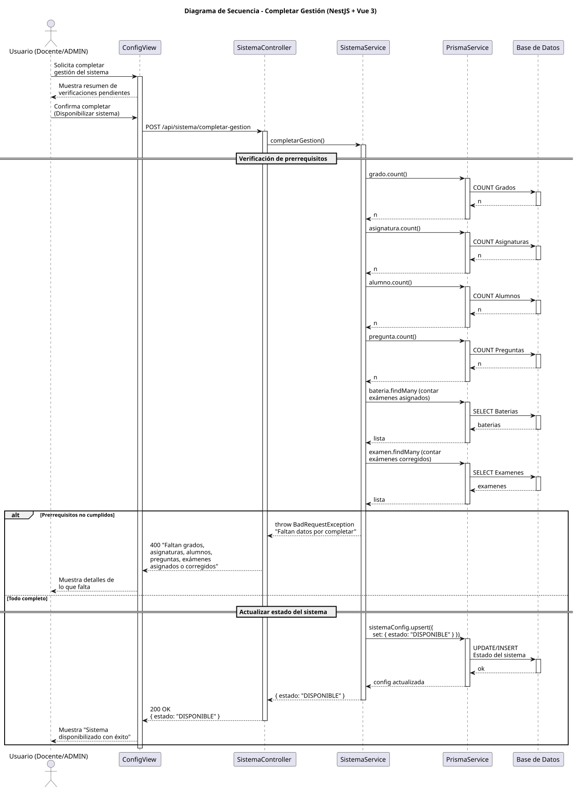

# 25-26-idsw2-sdVC > completarGestion > Diseño

## Información del artefacto

| Campo | Valor |
|-------|-------|
| **Proyecto** | Sistema de Gestión de Exámenes Universitarios |
| **Fase RUP** | Elaboración |
| **Disciplina** | Diseño |
| **Versión** | 1.0 (NestJS + Vue 3) |
| **Fecha** | 2026-06-09 |
| **Autor** | Marcos Gutierrez |

## Propósito

Completar la fase de gestión disponibilizando el sistema tras verificar que todos los prerrequisitos están cumplidos (grados, asignaturas, alumnos, preguntas, exámenes asignados y corregidos).

## Diagrama de secuencia de diseño

||
|-|
|Código fuente: [secuencia.puml](../../../modelosUML/diseño/completarGestion/secuencia.puml)|

## Participantes

| Componente | Responsabilidad |
|---|---|
| **ConfigView** | Interfaz de configuración del sistema. |
| **SistemaController** | POST /api/sistema/completar-gestion. |
| **SistemaService** | Verifica prerrequisitos y actualiza estado. |
| **PrismaService** | Capa ORM. |
| **Base de Datos** | Tabla de configuración del sistema. |

## Decisiones de diseño

| Decisión | Justificación |
|---|---|
| **Verificación de prerrequisitos en backend** | Garantiza integridad antes de cambiar estado. |
| **Estado del sistema en BD** | Persistencia de la configuración del sistema. |
| **Mensaje detallado si faltan datos** | El usuario sabe exactamente qué falta. |
| **Transición irreversible** | Sistema pasa a DISPONIBLE y no puede retroceder. |
