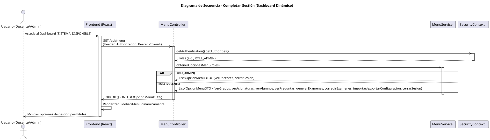

# Jorgestor > completarGestion > Diseño

> |[🏠️](/documents/diseño/README.md)|[📊](https://github.com/martinlopez7/25-26-IdSw1-SdR/blob/main/documents/casos-de-uso/detalladoCasosDeUso/completarGestion/completarGestion.svg)|[Análisis](/documents/analisis/completarGestion/README.md)|**Diseño**|
> |-|-|-|-|

## Información del artefacto

- **Proyecto**: Jorgestor - Sistema de Gestión de Exámenes
- **Fase RUP**: Elaboración
- **Disciplina**: Diseño
- **Versión**: 1.0 (Spring Boot + React + JWT)
- **Fecha**: 2026-05-30
- **Autor**: Equipo de desarrollo

## Propósito

Detallar la implementación técnica de la vista principal del sistema (`SISTEMA_DISPONIBLE`). Este diseño asegura que el menú de navegación sea dinámico y se construya en base a los roles del usuario autenticado (Admin o Docente), desacoplando la lógica de permisos del frontend mediante una API dedicada.

## Diagrama de secuencia de diseño

||
|-|
|[Código PlantUML](../../../modelosUML/diseño/completarGestion/secuencia.puml)|

## Participantes

- **Frontend (React + TypeScript)**: Componente `Sidebar` o `Dashboard` que consume las opciones de menú y las renderiza dinámicamente.
- **MenuController**: Endpoint REST `GET /api/menu` protegido por JWT.
- **MenuService**: Lógica de negocio que decide qué opciones retornar basándose en el rol extraído del `SecurityContextHolder`.
- **OpcionMenuDTO**: Clase de transferencia de datos que contiene el nombre de la opción, la ruta (link) y el icono.

## Decisiones de diseño

- **Menú en Servidor**: Las opciones de menú se gestionan en el backend para permitir cambios de permisos sin necesidad de desplegar nuevas versiones del frontend.
- **Seguridad**: El endpoint de menú requiere un token JWT válido. El rol se obtiene directamente del token procesado por Spring Security.
- **Componentes Dinámicos**: En el frontend, se usará un mapeo de la lista recibida para generar los componentes de navegación, asegurando que un usuario no vea opciones para las que no tiene permiso.
- **Tipado**: Uso de interfaces TypeScript para definir la estructura de `OpcionMenuDTO` recibida del backend.
