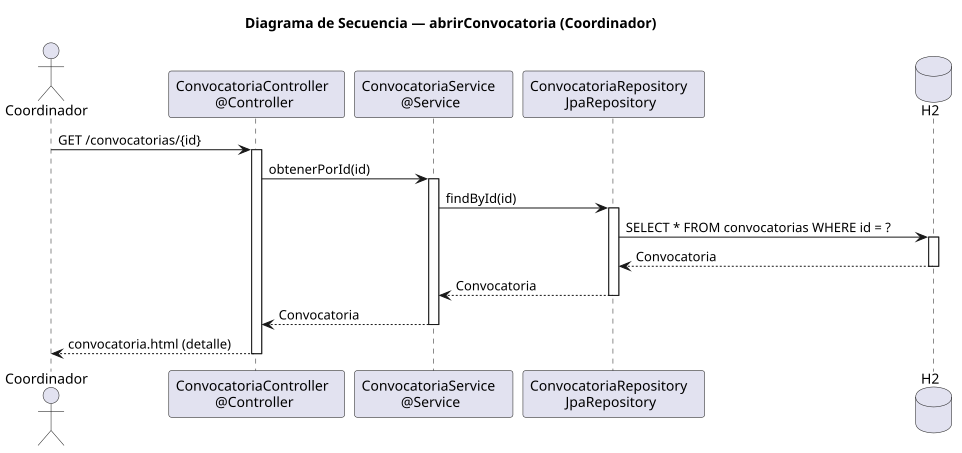

# abrirConvocatoria — Diseño

## Información del artefacto

- **Proyecto**: FUNIBER GIPF
- **Fase RUP**: Elaboración
- **Disciplina**: Diseño
- **Actor**: Coordinador
- **Caso de uso**: abrirConvocatoria()

## Propósito

Recuperar y mostrar el detalle completo de una convocatoria concreta.

## Diagrama de secuencia

[Código PlantUML](../../../modelosUML/diseño/coordinador/abrirConvocatoria.puml)

## Participantes

| Análisis | Spring Boot | Rol |
|---|---|---|
| Controlador de convocatorias | ConvocatoriaController @Controller | Atiende GET /convocatorias/{id} y devuelve convocatoria.html |
| Servicio de convocatorias | ConvocatoriaService @Service | `obtenerPorId(id)` recupera la convocatoria |
| Repositorio de convocatorias | ConvocatoriaRepository JpaRepository | Ejecuta SELECT * FROM convocatorias WHERE id = ? vía findById(id) |
| Base de datos | H2 | Almacén persistente |

## Rutas

| Método | URL | Acción |
|---|---|---|
| GET | /convocatorias/{id} | Muestra el detalle completo de la convocatoria |

## Decisiones de diseño

- El id llega como `@PathVariable`.
- `obtenerPorId(id)` usa `findById(id)` y resuelve el Optional con `orElseThrow()`.
- La vista `convocatoria.html` (detalle) incluye todos los campos de la entidad.
