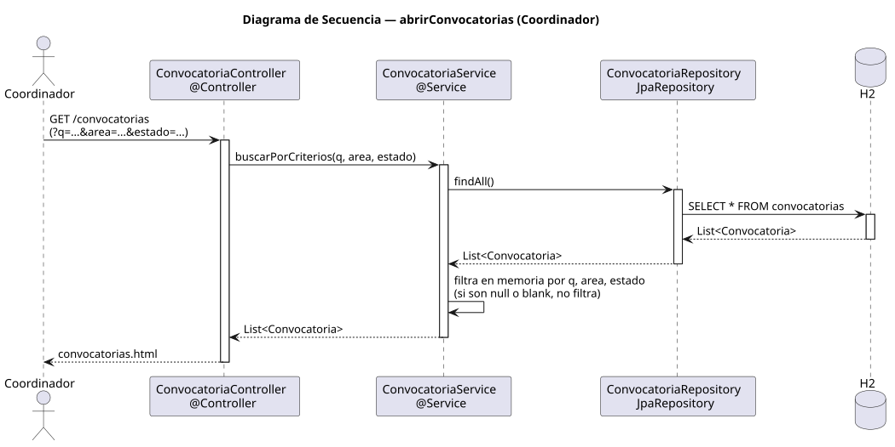

# abrirConvocatorias — Diseño

## Información del artefacto

- **Proyecto**: FUNIBER GIPF
- **Fase RUP**: Elaboración
- **Disciplina**: Diseño
- **Actor**: Coordinador
- **Caso de uso**: abrirConvocatorias()

## Propósito

Recuperar y mostrar el listado de convocatorias registradas en el sistema, con soporte de filtrado en memoria por texto, área y estado.

## Diagrama de secuencia

[Código PlantUML](../../../modelosUML/diseño/coordinador/abrirConvocatorias.puml)

## Participantes

| Análisis | Spring Boot | Rol |
|---|---|---|
| Controlador de convocatorias | ConvocatoriaController @Controller | Atiende GET /convocatorias con parámetros opcionales q, area y estado |
| Servicio de convocatorias | ConvocatoriaService @Service | `buscarPorCriterios(q, area, estado)` carga todas y filtra en memoria |
| Repositorio de convocatorias | ConvocatoriaRepository JpaRepository | Ejecuta SELECT * FROM convocatorias vía findAll() |
| Base de datos | H2 | Almacén persistente |

## Rutas

| Método | URL | Acción |
|---|---|---|
| GET | /convocatorias | Lista todas las convocatorias |
| GET | /convocatorias?q=...&area=...&estado=... | Lista convocatorias filtradas por los criterios indicados |

## Decisiones de diseño

- El servicio carga todas las convocatorias con `findAll()` y aplica los filtros en memoria; si los parámetros son null o blank, no filtra.
- Los parámetros q, area y estado son `@RequestParam` opcionales.
- La vista `convocatorias.html` muestra el listado y el botón "Importar convocatoria".
