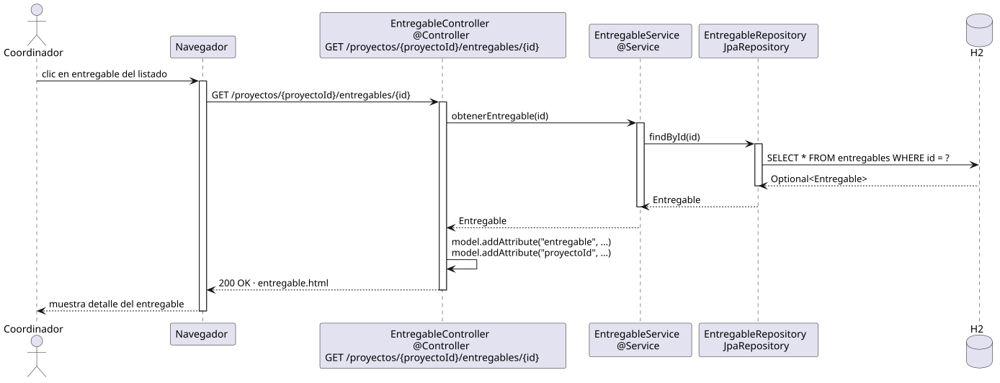

# abrirEntregable — Diseño

## Información del artefacto

- **Proyecto**: FUNIBER GIPF
- **Fase RUP**: Elaboración
- **Disciplina**: Diseño
- **Actor**: Coordinador
- **Caso de uso**: abrirEntregable()

## Propósito

Recuperar y mostrar el detalle completo de un entregable concreto dentro de su proyecto.

## Diagrama de secuencia

[Código PlantUML](../../../modelosUML/diseño/coordinador/abrirEntregable.puml)

## Participantes

| Análisis | Spring Boot | Rol |
|---|---|---|
| Controlador de entregables | EntregableController @Controller | Atiende GET /proyectos/{proyectoId}/entregables/{id} y prepara el modelo |
| Servicio de entregables | EntregableService @Service | `obtenerEntregable(id)` carga el entregable por id |
| Repositorio de entregables | EntregableRepository JpaRepository | Ejecuta SELECT * FROM entregables WHERE id = ? vía findById(id) |
| Base de datos | H2 | Almacén persistente |

## Rutas

| Método | URL | Acción |
|---|---|---|
| GET | /proyectos/{proyectoId}/entregables/{id} | Muestra el detalle del entregable |

## Decisiones de diseño

- El repositorio retorna `Optional<Entregable>`; el servicio lo resuelve con `orElseThrow()`.
- Se añaden al modelo `"entregable"` y `"proyectoId"` (para los enlaces de navegación: volver al listado, editar, eliminar).
- Si el entregable tiene `rutaArchivo`, la vista muestra el nombre del archivo adjunto.
