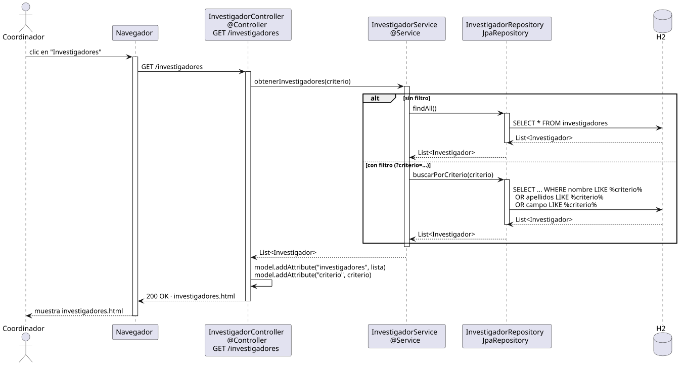

# abrirInvestigadores — Diseño

## Información del artefacto

- **Proyecto**: FUNIBER GIPF
- **Fase RUP**: Elaboración
- **Disciplina**: Diseño
- **Actor**: Coordinador
- **Caso de uso**: abrirInvestigadores()

## Propósito

Recuperar y mostrar la lista de investigadores del sistema. Soporta búsqueda opcional por criterio de texto (nombre, apellidos o campo).

## Diagrama de secuencia

[Código PlantUML](../../../modelosUML/diseño/coordinador/abrirInvestigadores.puml)

## Participantes

| Análisis | Spring Boot | Rol |
|---|---|---|
| Controlador de investigadores | InvestigadorController @Controller | Atiende GET /investigadores y prepara el modelo |
| Servicio de investigador | InvestigadorService @Service | `obtenerInvestigadores(criterio)` decide entre findAll o buscarPorCriterio |
| Repositorio de investigadores | InvestigadorRepository JpaRepository | Ejecuta la consulta SQL sobre la tabla investigadores |
| Base de datos | H2 | Almacén persistente |

## Rutas

| Método | URL | Acción |
|---|---|---|
| GET | /investigadores | Lista todos los investigadores del sistema |
| GET | /investigadores?criterio=texto | Lista investigadores filtrados por nombre, apellidos o campo |

## Decisiones de diseño

- Flujo alternativo `alt`: sin filtro → `findAll()` con SELECT * FROM investigadores; con filtro → `buscarPorCriterio(criterio)` con SELECT ... WHERE nombre LIKE %criterio% OR apellidos LIKE %criterio% OR campo LIKE %criterio%.
- El criterio es un `@RequestParam` opcional.
- Se añaden al modelo `"investigadores"` y `"criterio"` con `model.addAttribute`.
