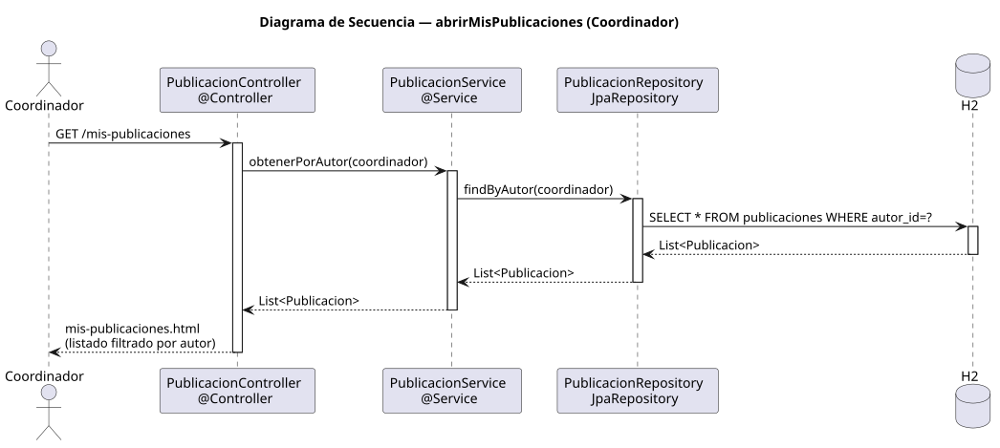

# abrirMisPublicaciones — Diseño

## Información del artefacto

- **Proyecto**: FUNIBER GIPF
- **Fase RUP**: Elaboración
- **Disciplina**: Diseño
- **Actor**: Coordinador
- **Caso de uso**: abrirMisPublicaciones()

## Propósito

Recuperar y mostrar el listado de publicaciones cuyo autor es el coordinador autenticado.

## Diagrama de secuencia

[Código PlantUML](../../../modelosUML/diseño/coordinador/abrirMisPublicaciones.puml)

## Participantes

| Análisis | Spring Boot | Rol |
|---|---|---|
| Controlador de publicaciones | PublicacionController @Controller | Atiende GET /mis-publicaciones; filtra por autor y devuelve mis-publicaciones.html |
| Servicio de publicaciones | PublicacionService @Service | `obtenerPorAutor(coordinador)` devuelve solo las publicaciones del autor |
| Repositorio de publicaciones | PublicacionRepository JpaRepository | Ejecuta SELECT * FROM publicaciones WHERE autor_id=? vía findByAutor(coordinador) |
| Base de datos | H2 | Almacén persistente |

## Rutas

| Método | URL | Acción |
|---|---|---|
| GET | /mis-publicaciones | Lista las publicaciones del coordinador autenticado |

## Decisiones de diseño

- El autor se obtiene del `@AuthenticationPrincipal`; el filtrado se delega al servicio con `obtenerPorAutor(coordinador)`.
- La URL `/mis-publicaciones` es compartida entre ambos actores.
- Desde la lista se puede navegar al detalle de cada publicación y crear una nueva.
