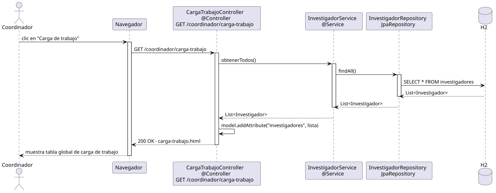

# abrirOpcionesCargaTrabajo — Diseño

## Información del artefacto

- **Proyecto**: FUNIBER GIPF
- **Fase RUP**: Elaboración
- **Disciplina**: Diseño
- **Actor**: Coordinador
- **Caso de uso**: abrirOpcionesCargaTrabajo()

## Propósito

Recuperar y mostrar la tabla global de carga de trabajo de todos los investigadores del sistema (horas semanales por categoría).

## Diagrama de secuencia

[Código PlantUML](../../../modelosUML/diseño/coordinador/abrirOpcionesCargaTrabajo.puml)

## Participantes

| Análisis | Spring Boot | Rol |
|---|---|---|
| Controlador de carga de trabajo | CargaTrabajoController @Controller | Atiende GET /coordinador/carga-trabajo y prepara el modelo |
| Servicio de investigador | InvestigadorService @Service | `obtenerTodos()` devuelve todos los investigadores |
| Repositorio de investigadores | InvestigadorRepository JpaRepository | Ejecuta SELECT * FROM investigadores vía findAll() |
| Base de datos | H2 | Almacén persistente |

## Rutas

| Método | URL | Acción |
|---|---|---|
| GET | /coordinador/carga-trabajo | Muestra la tabla global de carga de trabajo de todos los investigadores |

## Decisiones de diseño

- El controlador llama a `InvestigadorService.obtenerTodos()` que internamente usa `findAll()`.
- La lista de investigadores se añade al modelo con `model.addAttribute("investigadores", lista)`.
- La vista `carga-trabajo.html` muestra la tabla con horas de docencia, investigación y actividades por investigador.
- Cada fila incluye un enlace "Editar" que navega a `/investigadores/{id}/carga-trabajo/editar`.
