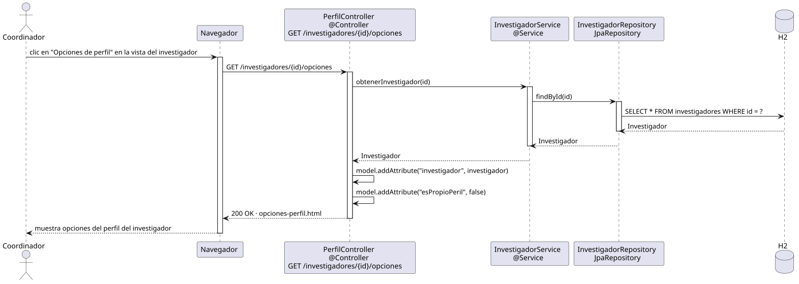

# abrirOpcionesPerfil — Diseño

## Información del artefacto

- **Proyecto**: FUNIBER GIPF
- **Fase RUP**: Elaboración
- **Disciplina**: Diseño
- **Actor**: Coordinador
- **Caso de uso**: abrirOpcionesPerfil()

## Propósito

Muestra al coordinador las opciones disponibles sobre el perfil de un investigador, cargando sus datos desde la base de datos.

## Diagrama de secuencia

[Código PlantUML](../../../modelosUML/diseño/coordinador/abrirOpcionesPerfil.puml)

## Participantes

| Análisis | Spring Boot | Rol |
|---|---|---|
| Controlador de perfil | PerfilController @Controller | Atiende GET /investigadores/{id}/opciones y prepara el modelo |
| Servicio de investigador | InvestigadorService @Service | Obtiene el investigador por id mediante `obtenerInvestigador(id)` |
| Repositorio de investigadores | InvestigadorRepository JpaRepository | Ejecuta SELECT * FROM investigadores WHERE id = ? |
| Base de datos | H2 | Almacén persistente de investigadores |

## Rutas

| Método | URL | Acción |
|---|---|---|
| GET | /investigadores/{id}/opciones | Muestra las opciones del perfil del investigador con el id dado |

## Decisiones de diseño

- El controlador recibe el `id` como `@PathVariable` y delega en `InvestigadorService.obtenerInvestigador(id)`.
- Se añaden dos atributos al modelo: `"investigador"` con los datos cargados y `"esPropioPeril"` con valor `false` (indica que es el perfil de otro usuario, no el propio del coordinador).
- El repositorio ejecuta `SELECT * FROM investigadores WHERE id = ?` vía `findById(id)`.
