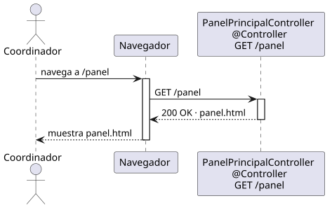

# abrirPanelPrincipal — Diseño

## Información del artefacto

- **Proyecto**: FUNIBER GIPF
- **Fase RUP**: Elaboración
- **Disciplina**: Diseño
- **Actor**: Coordinador
- **Caso de uso**: abrirPanelPrincipal()

## Propósito

Muestra al coordinador el panel principal de la plataforma tras autenticarse o al navegar a /panel.

## Diagrama de secuencia

[Código PlantUML](../../../modelosUML/diseño/coordinador/abrirPanelPrincipal.puml)

## Participantes

| Análisis | Spring Boot | Rol |
|---|---|---|
| Panel principal | PanelPrincipalController @Controller | Atiende GET /panel y devuelve la vista panel.html |

## Rutas

| Método | URL | Acción |
|---|---|---|
| GET | /panel | Devuelve la vista panel.html con código 200 OK |

## Decisiones de diseño

- El controlador no realiza llamadas a servicios ni a la base de datos; simplemente devuelve la vista `panel.html`.
- La respuesta es un 200 OK directo, sin redirecciones.
- Spring Security protege la ruta; cualquier acceso sin sesión activa redirige a /login.
