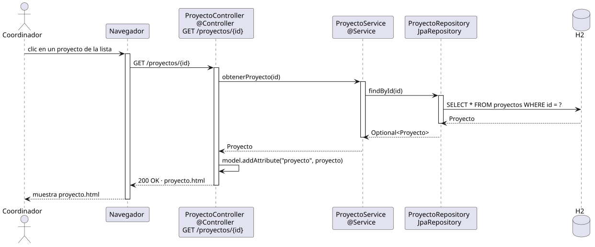

# abrirProyecto — Diseño

## Información del artefacto

- **Proyecto**: FUNIBER GIPF
- **Fase RUP**: Elaboración
- **Disciplina**: Diseño
- **Actor**: Coordinador
- **Caso de uso**: abrirProyecto()

## Propósito

Recuperar y mostrar los datos completos de un proyecto concreto identificado por su id.

## Diagrama de secuencia

[Código PlantUML](../../../modelosUML/diseño/coordinador/abrirProyecto.puml)

## Participantes

| Análisis | Spring Boot | Rol |
|---|---|---|
| Controlador de proyectos | ProyectoController @Controller | Atiende GET /proyectos/{id} y prepara el modelo |
| Servicio de proyectos | ProyectoService @Service | `obtenerProyecto(id)` recupera el proyecto por id |
| Repositorio de proyectos | ProyectoRepository JpaRepository | Ejecuta SELECT * FROM proyectos WHERE id = ? vía findById(id) |
| Base de datos | H2 | Almacén persistente |

## Rutas

| Método | URL | Acción |
|---|---|---|
| GET | /proyectos/{id} | Muestra el detalle del proyecto con el id dado |

## Decisiones de diseño

- El id llega como `@PathVariable Long id`.
- El repositorio retorna `Optional<Proyecto>`; el servicio lo resuelve con `orElseThrow()`.
- El proyecto se añade al modelo con `model.addAttribute("proyecto", proyecto)`.
- La vista incluye enlaces a editarProyecto, eliminarProyecto, abrirEntregables, agregarInvestigador y abrirInvestigadoresDeProyecto.
