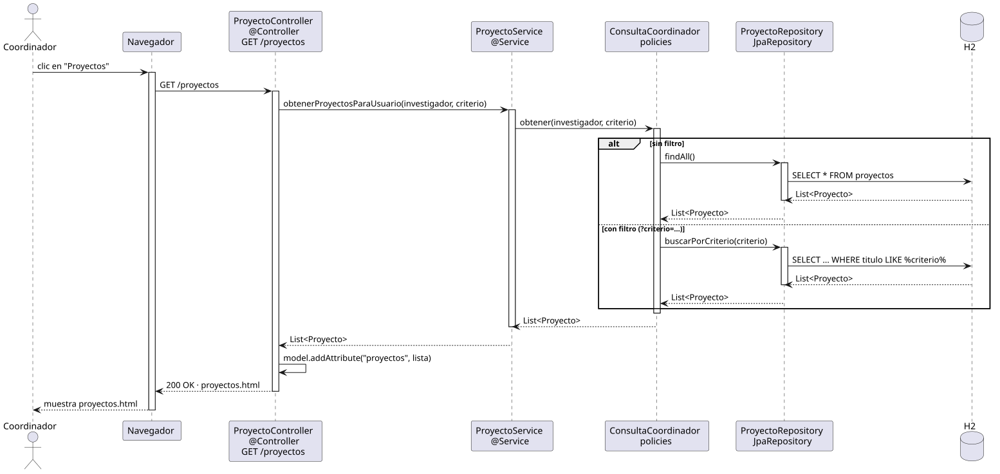

# abrirProyectos — Diseño

## Información del artefacto

- **Proyecto**: FUNIBER GIPF
- **Fase RUP**: Elaboración
- **Disciplina**: Diseño
- **Actor**: Coordinador
- **Caso de uso**: abrirProyectos()

## Propósito

Recuperar y mostrar la lista completa de proyectos del sistema. Soporta búsqueda opcional por criterio de texto.

## Diagrama de secuencia

[Código PlantUML](../../../modelosUML/diseño/coordinador/abrirProyectos.puml)

## Participantes

| Análisis | Spring Boot | Rol |
|---|---|---|
| Controlador de proyectos | ProyectoController @Controller | Atiende GET /proyectos y prepara el modelo |
| Servicio de proyectos | ProyectoService @Service | `obtenerProyectosParaUsuario(investigador, criterio)` delega en la policy |
| Policy de consulta | ConsultaCoordinador policies | Decide entre findAll() o buscarPorCriterio(criterio) según el parámetro |
| Repositorio de proyectos | ProyectoRepository JpaRepository | Ejecuta la consulta SQL sobre la tabla proyectos |
| Base de datos | H2 | Almacén persistente |

## Rutas

| Método | URL | Acción |
|---|---|---|
| GET | /proyectos | Lista todos los proyectos del sistema |
| GET | /proyectos?criterio=texto | Lista proyectos filtrados por título |

## Decisiones de diseño

- Flujo alternativo `alt`: sin filtro → `findAll()` con SELECT * FROM proyectos; con filtro → `buscarPorCriterio(criterio)` con SELECT ... WHERE titulo LIKE %criterio%.
- El criterio de búsqueda se pasa como `@RequestParam` opcional.
- La lista se añade al modelo con `model.addAttribute("proyectos", lista)`.
- La vista muestra el botón "Nuevo proyecto" (solo disponible para el coordinador).
