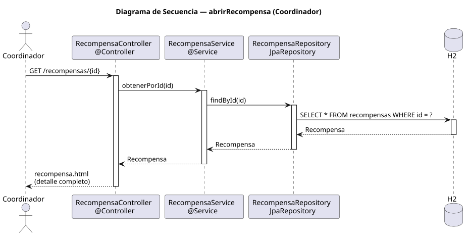

# abrirRecompensa — Diseño

## Información del artefacto

- **Proyecto**: FUNIBER GIPF
- **Fase RUP**: Elaboración
- **Disciplina**: Diseño
- **Actor**: Coordinador
- **Caso de uso**: abrirRecompensa()

## Propósito

Mostrar el detalle completo de una recompensa concreta. El coordinador puede acceder al detalle de cualquier recompensa del sistema.

## Diagrama de secuencia

[Código PlantUML](../../../modelosUML/diseño/coordinador/abrirRecompensa.puml)

## Participantes

| Análisis | Spring Boot | Rol |
|---|---|---|
| Controlador de recompensas | RecompensaController @Controller | Atiende GET /recompensas/{id} y devuelve recompensa.html |
| Servicio de recompensas | RecompensaService @Service | `obtenerPorId(id)` recupera la recompensa |
| Repositorio de recompensas | RecompensaRepository JpaRepository | Ejecuta SELECT * FROM recompensas WHERE id = ? vía findById(id) |
| Base de datos | H2 | Almacén persistente |

## Rutas

| Método | URL | Acción |
|---|---|---|
| GET | /recompensas/{id} | Muestra el detalle completo de la recompensa |

## Decisiones de diseño

- El id llega como `@PathVariable`.
- La vista `recompensa.html` muestra el detalle completo e incluye los enlaces Editar y Eliminar (solo visibles para el coordinador).
