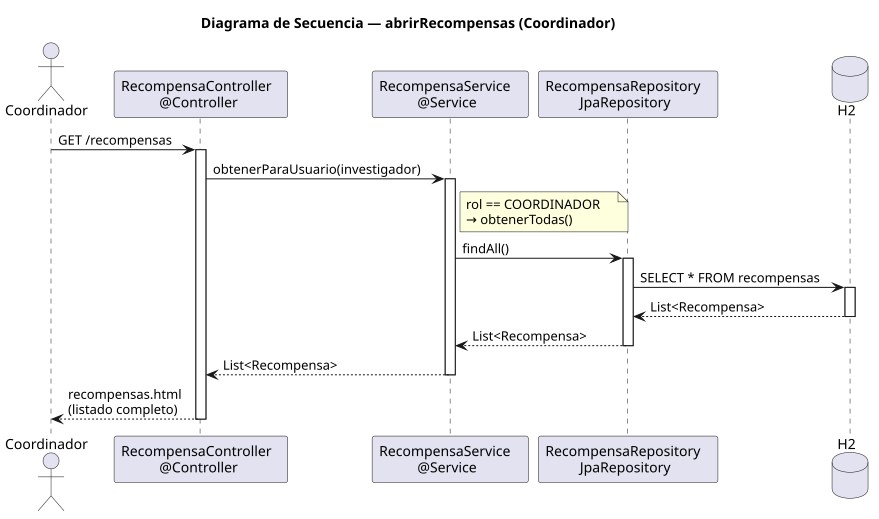

# abrirRecompensas — Diseño

## Información del artefacto

- **Proyecto**: FUNIBER GIPF
- **Fase RUP**: Elaboración
- **Disciplina**: Diseño
- **Actor**: Coordinador
- **Caso de uso**: abrirRecompensas()

## Propósito

Mostrar al coordinador el listado completo de todas las recompensas registradas en el sistema.

## Diagrama de secuencia

[Código PlantUML](../../../modelosUML/diseño/coordinador/abrirRecompensas.puml)

## Participantes

| Análisis | Spring Boot | Rol |
|---|---|---|
| Controlador de recompensas | RecompensaController @Controller | Atiende GET /recompensas; detecta rol COORDINADOR |
| Servicio de recompensas | RecompensaService @Service | `obtenerParaUsuario(investigador)` → rol COORDINADOR → `obtenerTodas()` via findAll() |
| Repositorio de recompensas | RecompensaRepository JpaRepository | Ejecuta SELECT * FROM recompensas vía findAll() |
| Base de datos | H2 | Almacén persistente |

## Rutas

| Método | URL | Acción |
|---|---|---|
| GET | /recompensas | Muestra el listado completo de todas las recompensas (coordinador ve todas) |

## Decisiones de diseño

- El mismo endpoint `/recompensas` sirve a ambos roles; el servicio ramifica por rol (`rol == COORDINADOR → obtenerTodas()`).
- La nota en el diagrama indica: `rol == COORDINADOR → obtenerTodas()`.
- La vista `recompensas.html` muestra el listado completo con enlace al detalle de cada recompensa y botón "Crear recompensa".
