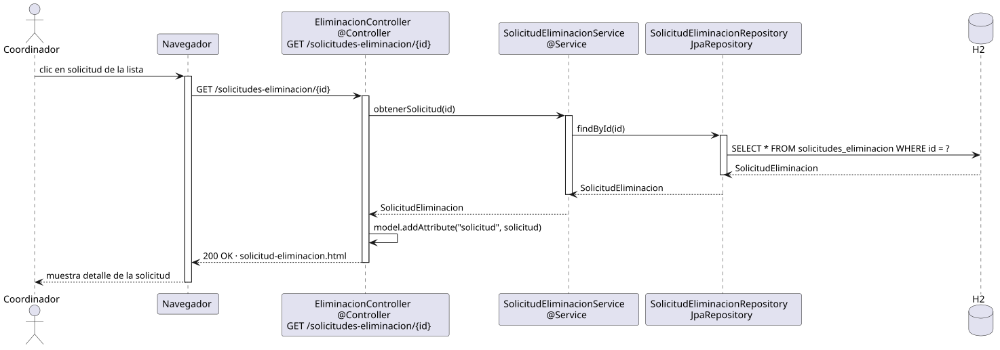

# abrirSolicitudEliminacionPerfil — Diseño

## Información del artefacto

- **Proyecto**: FUNIBER GIPF
- **Fase RUP**: Elaboración
- **Disciplina**: Diseño
- **Actor**: Coordinador
- **Caso de uso**: abrirSolicitudEliminacionPerfil()

## Propósito

Recuperar y mostrar el detalle de una solicitud de eliminación de perfil concreta, permitiendo al coordinador navegar al perfil del investigador implicado para resolver la solicitud.

## Diagrama de secuencia

[Código PlantUML](../../../modelosUML/diseño/coordinador/abrirSolicitudEliminacionPerfil.puml)

## Participantes

| Análisis | Spring Boot | Rol |
|---|---|---|
| Controlador de eliminación | EliminacionController @Controller | Atiende GET /solicitudes-eliminacion/{id} y prepara el modelo |
| Servicio de solicitud de eliminación | SolicitudEliminacionService @Service | `obtenerSolicitud(id)` recupera la solicitud por id |
| Repositorio de solicitudes | SolicitudEliminacionRepository JpaRepository | Ejecuta SELECT * FROM solicitudes_eliminacion WHERE id = ? vía findById(id) |
| Base de datos | H2 | Almacén persistente |

## Rutas

| Método | URL | Acción |
|---|---|---|
| GET | /solicitudes-eliminacion/{id} | Muestra el detalle de la solicitud |

## Decisiones de diseño

- El id llega como `@PathVariable`.
- La solicitud se añade al modelo con `model.addAttribute("solicitud", solicitud)`.
- La vista `solicitud-eliminacion.html` enlaza a `/investigadores/{investigador.id}/opciones` para resolver la solicitud.
