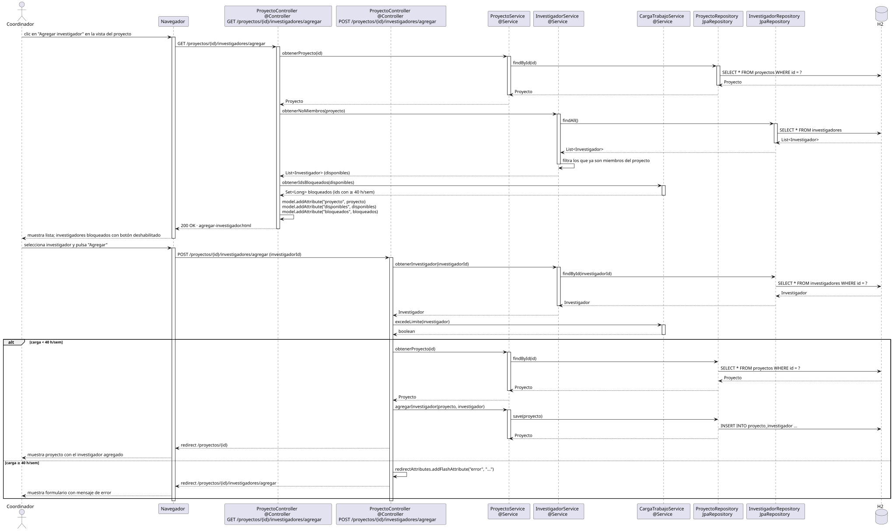

# agregarInvestigador — Diseño

## Información del artefacto

- **Proyecto**: FUNIBER GIPF
- **Fase RUP**: Elaboración
- **Disciplina**: Diseño
- **Actor**: Coordinador
- **Caso de uso**: agregarInvestigador()

## Propósito

Mostrar la lista de investigadores disponibles para agregar al proyecto y, tras la selección, incorporar al investigador elegido al equipo del proyecto; bloqueando a los que superen el límite de carga de trabajo.

## Diagrama de secuencia

[Código PlantUML](../../../modelosUML/diseño/coordinador/agregarInvestigador.puml)

## Participantes

| Análisis | Spring Boot | Rol |
|---|---|---|
| Controlador de proyectos (GET) | ProyectoController @Controller GET /proyectos/{id}/investigadores/agregar | Carga el proyecto, la lista de disponibles y los ids bloqueados |
| Controlador de proyectos (POST) | ProyectoController @Controller POST /proyectos/{id}/investigadores/agregar | Verifica la carga y agrega el investigador |
| Servicio de proyectos | ProyectoService @Service | `obtenerProyecto(id)` y `agregarInvestigador(proyecto, investigador)` |
| Servicio de investigador | InvestigadorService @Service | `obtenerNoMiembros(proyecto)` filtra los que ya son miembros |
| Servicio de carga de trabajo | CargaTrabajoService @Service | `obtenerIdsBloqueados(disponibles)` devuelve ids con >= 40 h/sem; `excedeLimite(investigador)` en POST |
| Repositorio de proyectos | ProyectoRepository JpaRepository | SELECT por id y UPDATE (INSERT en proyecto_investigador) via save |
| Repositorio de investigadores | InvestigadorRepository JpaRepository | findAll() para obtener todos y filtrar disponibles |
| Base de datos | H2 | Almacén persistente |

## Rutas

| Método | URL | Acción |
|---|---|---|
| GET | /proyectos/{id}/investigadores/agregar | Muestra la lista de investigadores disponibles |
| POST | /proyectos/{id}/investigadores/agregar | Agrega al investigador seleccionado (investigadorId como parámetro) |

## Decisiones de diseño

- El GET añade al modelo: `"proyecto"`, `"disponibles"` (investigadores no miembros) y `"bloqueados"` (Set<Long> con ids que tienen >= 40 h/sem). El template deshabilita el botón de agregar para los bloqueados.
- Flujo alternativo `alt` en el POST: si la carga es < 40 h/sem → `agregarInvestigador(proyecto, investigador)` hace `save` con INSERT en proyecto_investigador, redirect a `/proyectos/{id}`; si es >= 40 h/sem → `redirectAttributes.addFlashAttribute("error", "...")` y redirect al formulario de agregar con mensaje de error.
- `InvestigadorService.obtenerNoMiembros(proyecto)` usa `findAll()` y filtra en memoria los que ya son miembros.
