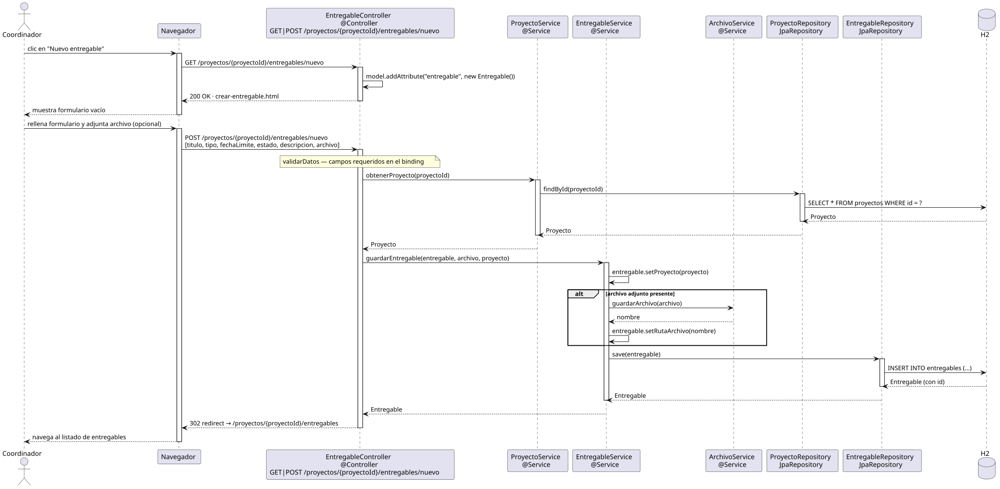

# crearEntregable — Diseño

## Información del artefacto

- **Proyecto**: FUNIBER GIPF
- **Fase RUP**: Elaboración
- **Disciplina**: Diseño
- **Actor**: Coordinador
- **Caso de uso**: crearEntregable()

## Propósito

Mostrar el formulario de creación, persistir el nuevo entregable asociado a un proyecto y guardar el archivo adjunto si se proporciona.

## Diagrama de secuencia

[Código PlantUML](../../../modelosUML/diseño/coordinador/crearEntregable.puml)

## Participantes

| Análisis | Spring Boot | Rol |
|---|---|---|
| Controlador de entregables (GET) | EntregableController @Controller GET /proyectos/{proyectoId}/entregables/nuevo | Sirve el formulario vacío |
| Controlador de entregables (POST) | EntregableController @Controller POST /proyectos/{proyectoId}/entregables/nuevo | Persiste el entregable |
| Servicio de proyectos | ProyectoService @Service | `obtenerProyecto(proyectoId)` carga el proyecto para asociarlo |
| Servicio de entregables | EntregableService @Service | `guardarEntregable(entregable, archivo, proyecto)` gestiona archivo y persiste |
| Servicio de archivos | ArchivoService @Service | `guardarArchivo(archivo)` guarda el fichero y devuelve el nombre |
| Repositorio de proyectos | ProyectoRepository JpaRepository | SELECT * FROM proyectos WHERE id = ? |
| Repositorio de entregables | EntregableRepository JpaRepository | Ejecuta INSERT INTO entregables (...) |
| Base de datos | H2 | Almacén persistente |

## Rutas

| Método | URL | Acción |
|---|---|---|
| GET | /proyectos/{proyectoId}/entregables/nuevo | Muestra el formulario vacío |
| POST | /proyectos/{proyectoId}/entregables/nuevo | Recibe titulo, tipo, fechaLimite, estado, descripcion, archivo y guarda |

## Decisiones de diseño

- En el GET, el controller añade `model.addAttribute("entregable", new Entregable())` para el binding.
- En el POST se aplica validación de datos (`validarDatos`); luego se carga el proyecto con `obtenerProyecto(proyectoId)` y se llama a `guardarEntregable(entregable, archivo, proyecto)`.
- Flujo alternativo `alt` en el servicio: si hay archivo adjunto → `ArchivoSvc.guardarArchivo(archivo)` devuelve el nombre y se asigna a `entregable.setRutaArchivo(nombre)`.
- El servicio asigna el proyecto con `entregable.setProyecto(proyecto)` antes de llamar a `save(entregable)`.
- Tras guardar, redirige a `/proyectos/{proyectoId}/entregables` (302 redirect).
