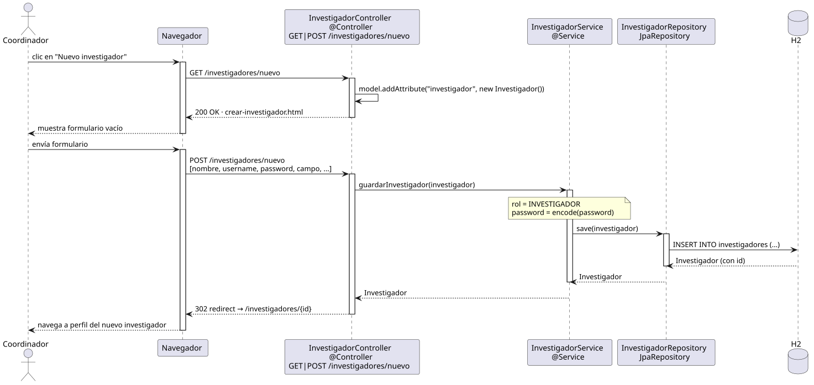

# crearInvestigador — Diseño

## Información del artefacto

- **Proyecto**: FUNIBER GIPF
- **Fase RUP**: Elaboración
- **Disciplina**: Diseño
- **Actor**: Coordinador
- **Caso de uso**: crearInvestigador()

## Propósito

Mostrar el formulario de creación de un nuevo investigador y persistirlo con sus datos mínimos obligatorios.

## Diagrama de secuencia

[Código PlantUML](../../../modelosUML/diseño/coordinador/crearInvestigador.puml)

## Participantes

| Análisis | Spring Boot | Rol |
|---|---|---|
| Controlador de investigadores (GET) | InvestigadorController @Controller GET /investigadores/nuevo | Sirve el formulario vacío |
| Controlador de investigadores (POST) | InvestigadorController @Controller POST /investigadores/nuevo | Persiste el nuevo investigador |
| Servicio de investigador | InvestigadorService @Service | `guardarInvestigador(investigador)` codifica la contraseña y persiste |
| Repositorio de investigadores | InvestigadorRepository JpaRepository | Ejecuta INSERT INTO investigadores (...) vía save(investigador) |
| Base de datos | H2 | Almacén persistente |

## Rutas

| Método | URL | Acción |
|---|---|---|
| GET | /investigadores/nuevo | Muestra el formulario vacío con un Investigador vacío en el modelo |
| POST | /investigadores/nuevo | Recibe nombre, username, password, campo y demás campos; guarda y redirige |

## Decisiones de diseño

- En el GET, el controller añade `model.addAttribute("investigador", new Investigador())` para el binding.
- El POST recibe los campos: nombre, username, password, campo, y opcionales (apellidos, carrera, master).
- Nota en el servicio: `rol = INVESTIGADOR` (fijo) y `password = encode(password)` con BCrypt antes de persistir.
- Tras guardar, redirige a `redirect:/investigadores/{id}` del nuevo investigador (302, PRG).
