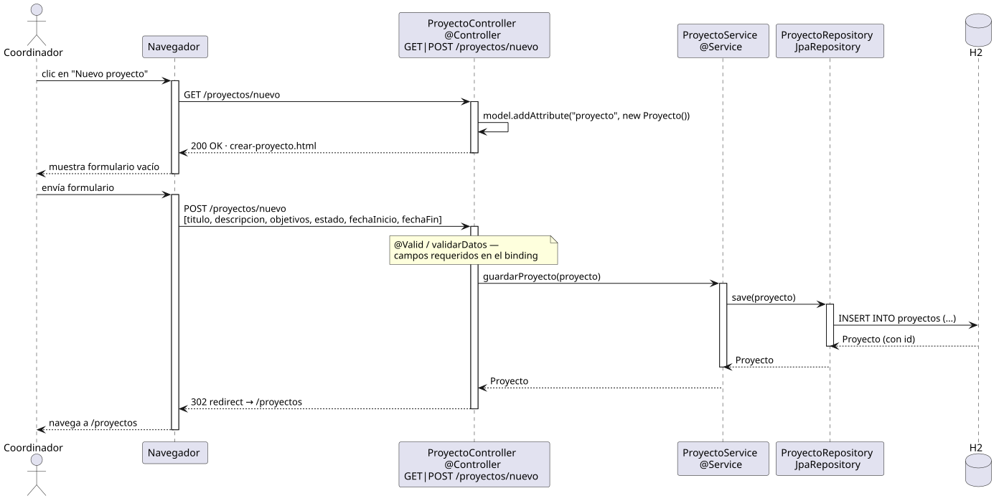

# crearProyecto — Diseño

## Información del artefacto

- **Proyecto**: FUNIBER GIPF
- **Fase RUP**: Elaboración
- **Disciplina**: Diseño
- **Actor**: Coordinador
- **Caso de uso**: crearProyecto()

## Propósito

Mostrar el formulario de creación y persistir un nuevo proyecto tras validar los datos mínimos.

## Diagrama de secuencia

[Código PlantUML](../../../modelosUML/diseño/coordinador/crearProyecto.puml)

## Participantes

| Análisis | Spring Boot | Rol |
|---|---|---|
| Controlador de proyectos | ProyectoController @Controller GET|POST /proyectos/nuevo | Sirve el formulario vacío (GET) y persiste el proyecto (POST) |
| Servicio de proyectos | ProyectoService @Service | `guardarProyecto(proyecto)` guarda la entidad |
| Repositorio de proyectos | ProyectoRepository JpaRepository | Ejecuta INSERT INTO proyectos (...) vía save(proyecto) |
| Base de datos | H2 | Almacén persistente |

## Rutas

| Método | URL | Acción |
|---|---|---|
| GET | /proyectos/nuevo | Muestra el formulario vacío con un Proyecto vacío en el modelo |
| POST | /proyectos/nuevo | Recibe titulo, descripcion, objetivos, estado, fechaInicio, fechaFin y guarda |

## Decisiones de diseño

- En el GET, el controller añade `model.addAttribute("proyecto", new Proyecto())` para el binding del formulario.
- El POST aplica validación de campos requeridos (`@Valid / validarDatos`) en el binding antes de llamar al servicio.
- `ProyectoService.guardarProyecto(proyecto)` llama a `save(proyecto)` que ejecuta INSERT y devuelve el Proyecto con id asignado.
- Tras guardar, redirige a `/proyectos` (302 redirect, patrón PRG).
