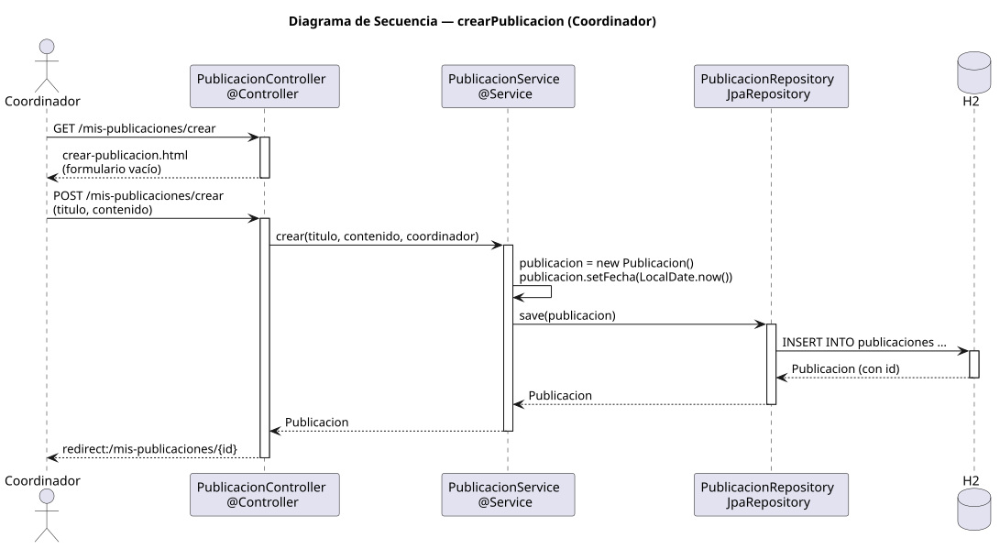

# crearPublicacion — Diseño

## Información del artefacto

- **Proyecto**: FUNIBER GIPF
- **Fase RUP**: Elaboración
- **Disciplina**: Diseño
- **Actor**: Coordinador
- **Caso de uso**: crearPublicacion()

## Propósito

Presentar un formulario vacío, recoger los datos introducidos por el coordinador y persistir la nueva publicación con él como autor.

## Diagrama de secuencia

[Código PlantUML](../../../modelosUML/diseño/coordinador/crearPublicacion.puml)

## Participantes

| Análisis | Spring Boot | Rol |
|---|---|---|
| Controlador de publicaciones (GET) | PublicacionController @Controller GET /mis-publicaciones/crear | Sirve el formulario vacío |
| Controlador de publicaciones (POST) | PublicacionController @Controller POST /mis-publicaciones/crear | Persiste la publicación y redirige |
| Servicio de publicaciones | PublicacionService @Service | `crear(titulo, contenido, coordinador)` instancia, asigna fecha y persiste |
| Repositorio de publicaciones | PublicacionRepository JpaRepository | Ejecuta INSERT INTO publicaciones vía save(publicacion) |
| Base de datos | H2 | Almacén persistente |

## Rutas

| Método | URL | Acción |
|---|---|---|
| GET | /mis-publicaciones/crear | Muestra el formulario de creación vacío |
| POST | /mis-publicaciones/crear | Recibe titulo y contenido; persiste y redirige al detalle |

## Decisiones de diseño

- El autor se obtiene del `@AuthenticationPrincipal`; no viene del formulario.
- El servicio instancia `new Publicacion()`, asigna `fecha = LocalDate.now()`, autor y demás datos, y llama a `save(publicacion)`.
- Tras guardar, redirige a `redirect:/mis-publicaciones/{id}` con el id devuelto por el repositorio (302).
