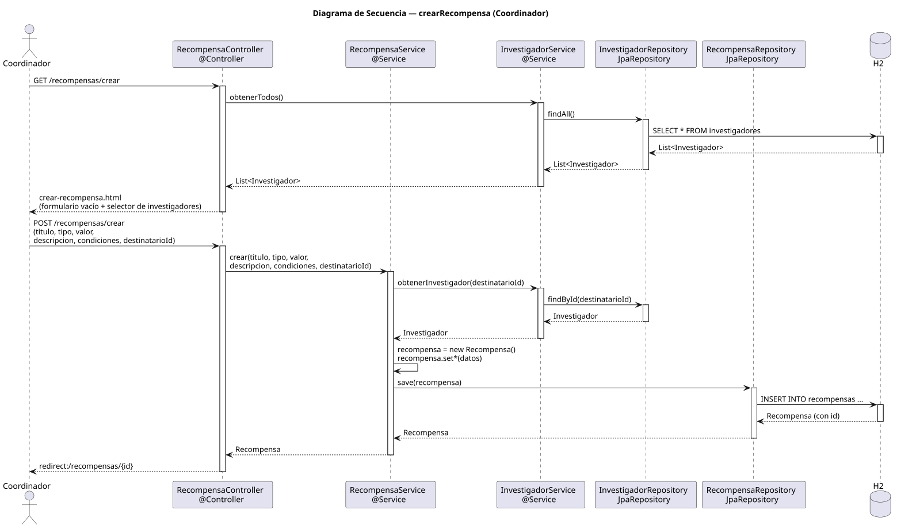

# crearRecompensa — Diseño

## Información del artefacto

- **Proyecto**: FUNIBER GIPF
- **Fase RUP**: Elaboración
- **Disciplina**: Diseño
- **Actor**: Coordinador
- **Caso de uso**: crearRecompensa()

## Propósito

Presentar un formulario para que el coordinador registre una nueva recompensa asignada a un investigador concreto.

## Diagrama de secuencia

[Código PlantUML](../../../modelosUML/diseño/coordinador/crearRecompensa.puml)

## Participantes

| Análisis | Spring Boot | Rol |
|---|---|---|
| Controlador de recompensas (GET) | RecompensaController @Controller GET /recompensas/crear | Carga la lista de investigadores y sirve el formulario |
| Controlador de recompensas (POST) | RecompensaController @Controller POST /recompensas/crear | Persiste la nueva recompensa |
| Servicio de recompensas | RecompensaService @Service | `crear(titulo, tipo, valor, descripcion, condiciones, destinatarioId)` |
| Servicio de investigador | InvestigadorService @Service | `obtenerTodos()` en GET; `obtenerInvestigador(destinatarioId)` en el servicio POST |
| Repositorio de investigadores | InvestigadorRepository JpaRepository | findAll() para poblar el selector; findById para el destinatario |
| Repositorio de recompensas | RecompensaRepository JpaRepository | Ejecuta INSERT INTO recompensas vía save(recompensa) |
| Base de datos | H2 | Almacén persistente |

## Rutas

| Método | URL | Acción |
|---|---|---|
| GET | /recompensas/crear | Muestra el formulario vacío con el selector de investigadores |
| POST | /recompensas/crear | Recibe titulo, tipo, valor, descripcion, condiciones, destinatarioId y persiste |

## Decisiones de diseño

- El GET llama a `InvestigadorService.obtenerTodos()` para poblar el selector de destinatario con todos los investigadores.
- En el POST, `crear(...)` resuelve el investigador destinatario con `obtenerInvestigador(destinatarioId)`, instancia `new Recompensa()`, aplica los setters y llama a `save(recompensa)`.
- Tras guardar, redirige a `redirect:/recompensas/{id}` (302, PRG).
