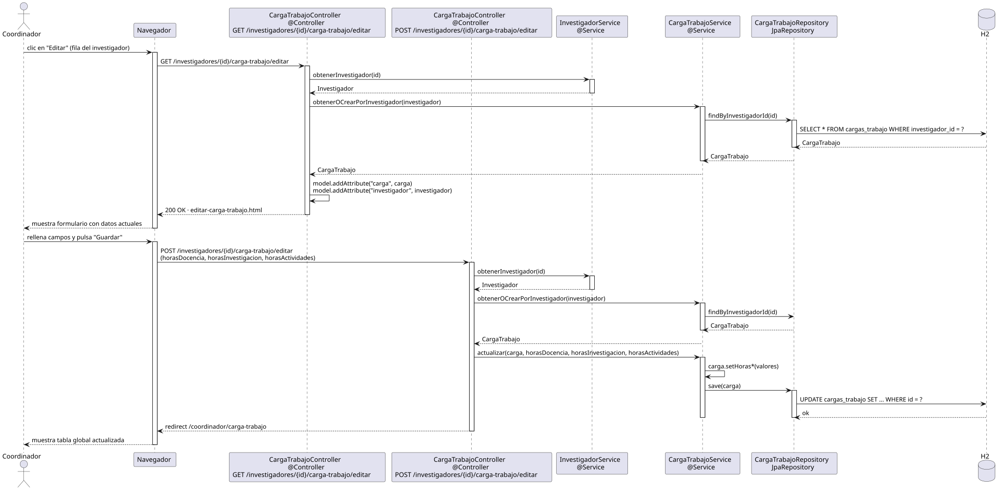

# editarCargaTrabajo — Diseño

## Información del artefacto

- **Proyecto**: FUNIBER GIPF
- **Fase RUP**: Elaboración
- **Disciplina**: Diseño
- **Actor**: Coordinador
- **Caso de uso**: editarCargaTrabajo()

## Propósito

Mostrar el formulario de edición de carga de trabajo de un investigador concreto y persistir los cambios introducidos por el coordinador.

## Diagrama de secuencia

[Código PlantUML](../../../modelosUML/diseño/coordinador/editarCargaTrabajo.puml)

## Participantes

| Análisis | Spring Boot | Rol |
|---|---|---|
| Controlador de carga de trabajo (GET) | CargaTrabajoController @Controller GET /investigadores/{id}/carga-trabajo/editar | Carga los datos actuales y sirve el formulario |
| Controlador de carga de trabajo (POST) | CargaTrabajoController @Controller POST /investigadores/{id}/carga-trabajo/editar | Recibe los tres campos y persiste los cambios |
| Servicio de investigador | InvestigadorService @Service | `obtenerInvestigador(id)` para cargar el investigador |
| Servicio de carga de trabajo | CargaTrabajoService @Service | `obtenerOCrearPorInvestigador(investigador)` y `actualizar(carga, horas...)` |
| Repositorio de carga de trabajo | CargaTrabajoRepository JpaRepository | SELECT por investigador_id y UPDATE vía save(carga) |
| Base de datos | H2 | Almacén persistente |

## Rutas

| Método | URL | Acción |
|---|---|---|
| GET | /investigadores/{id}/carga-trabajo/editar | Muestra el formulario con los datos actuales de la carga de trabajo |
| POST | /investigadores/{id}/carga-trabajo/editar | Persiste horasDocencia, horasInvestigacion, horasActividades y redirige |

## Decisiones de diseño

- Tanto en GET como en POST, se llama primero a `InvestigadorService.obtenerInvestigador(id)` para obtener el investigador.
- `CargaTrabajoService.obtenerOCrearPorInvestigador(investigador)` usa `findByInvestigadorId(id)`; crea la entrada si no existe.
- En el POST, `actualizar(carga, horasDocencia, horasInvestigacion, horasActividades)` aplica los setters y luego llama a `save(carga)` con UPDATE.
- Tras guardar, redirige a `/coordinador/carga-trabajo` (302), volviendo a la tabla global.
