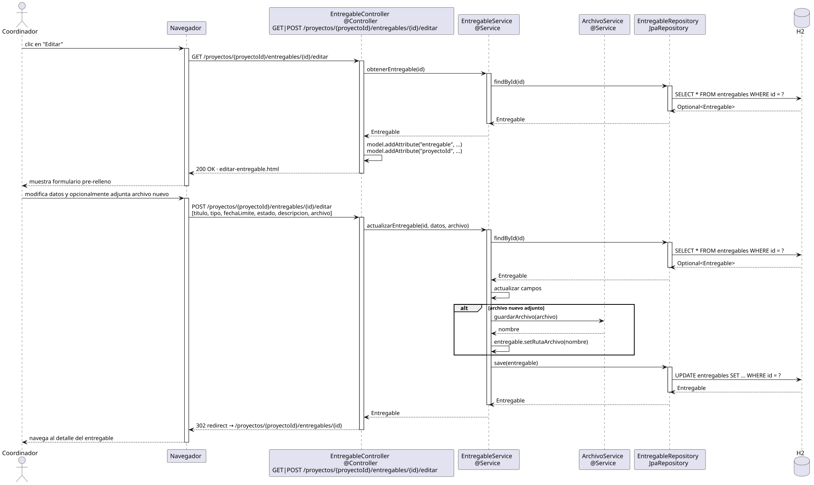

# editarEntregable — Diseño

## Información del artefacto

- **Proyecto**: FUNIBER GIPF
- **Fase RUP**: Elaboración
- **Disciplina**: Diseño
- **Actor**: Coordinador
- **Caso de uso**: editarEntregable()

## Propósito

Mostrar el formulario pre-relleno con los datos del entregable y persistir los cambios, permitiendo reemplazar el archivo adjunto.

## Diagrama de secuencia

[Código PlantUML](../../../modelosUML/diseño/coordinador/editarEntregable.puml)

## Participantes

| Análisis | Spring Boot | Rol |
|---|---|---|
| Controlador de entregables (GET) | EntregableController @Controller GET /proyectos/{proyectoId}/entregables/{id}/editar | Carga el entregable y sirve el formulario pre-relleno |
| Controlador de entregables (POST) | EntregableController @Controller POST /proyectos/{proyectoId}/entregables/{id}/editar | Actualiza los datos y opcionalmente el archivo |
| Servicio de entregables | EntregableService @Service | `obtenerEntregable(id)` y `actualizarEntregable(id, datos, archivo)` |
| Servicio de archivos | ArchivoService @Service | `guardarArchivo(archivo)` si se adjunta uno nuevo |
| Repositorio de entregables | EntregableRepository JpaRepository | SELECT por id (GET) y UPDATE vía save(entregable) (POST) |
| Base de datos | H2 | Almacén persistente |

## Rutas

| Método | URL | Acción |
|---|---|---|
| GET | /proyectos/{proyectoId}/entregables/{id}/editar | Muestra el formulario pre-relleno |
| POST | /proyectos/{proyectoId}/entregables/{id}/editar | Guarda titulo, tipo, fechaLimite, estado, descripcion y archivo opcional |

## Decisiones de diseño

- En el GET, se añaden al modelo `"entregable"` y `"proyectoId"` para el formulario y la navegación.
- En el POST, `actualizarEntregable(id, datos, archivo)` hace `findById`, actualiza los campos y:
  - Flujo alternativo `alt`: si hay archivo nuevo adjunto → `ArchivoSvc.guardarArchivo(archivo)` y `entregable.setRutaArchivo(nombre)`; si no, `rutaArchivo` se mantiene sin cambios.
- Tras guardar, redirige a `/proyectos/{proyectoId}/entregables/{id}` (302 redirect).
