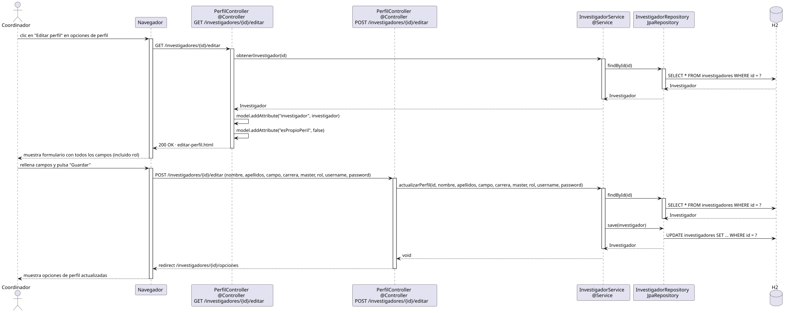

# editarPerfil — Diseño

## Información del artefacto

- **Proyecto**: FUNIBER GIPF
- **Fase RUP**: Elaboración
- **Disciplina**: Diseño
- **Actor**: Coordinador
- **Caso de uso**: editarPerfil()

## Propósito

Permite al coordinador editar los datos de perfil de un investigador, incluyendo el campo rol, y persiste los cambios en la base de datos.

## Diagrama de secuencia

[Código PlantUML](../../../modelosUML/diseño/coordinador/editarPerfil.puml)

## Participantes

| Análisis | Spring Boot | Rol |
|---|---|---|
| Controlador de perfil (GET) | PerfilController @Controller GET /investigadores/{id}/editar | Carga el investigador y sirve el formulario pre-relleno |
| Controlador de perfil (POST) | PerfilController @Controller POST /investigadores/{id}/editar | Recibe y persiste los datos modificados |
| Servicio de investigador | InvestigadorService @Service | `obtenerInvestigador(id)` y `actualizarPerfil(id, ...)` |
| Repositorio de investigadores | InvestigadorRepository JpaRepository | SELECT por id (GET y POST) y UPDATE via save(investigador) |
| Base de datos | H2 | Almacén persistente de investigadores |

## Rutas

| Método | URL | Acción |
|---|---|---|
| GET | /investigadores/{id}/editar | Muestra el formulario de edición pre-relleno |
| POST | /investigadores/{id}/editar | Guarda los cambios del perfil y redirige a las opciones |

## Decisiones de diseño

- En el GET, se pasan al modelo `"investigador"` y `"esPropioPeril" = false`; el formulario incluye el campo `rol` (exclusivo de la edición por coordinador).
- El POST recibe los campos: nombre, apellidos, campo, carrera, master, rol, username, password.
- `InvestigadorService.actualizarPerfil(id, ...)` hace primero `findById` para cargar la entidad y luego `save(investigador)` para persistir con UPDATE.
- Tras guardar, se redirige a `/investigadores/{id}/opciones` (302).
