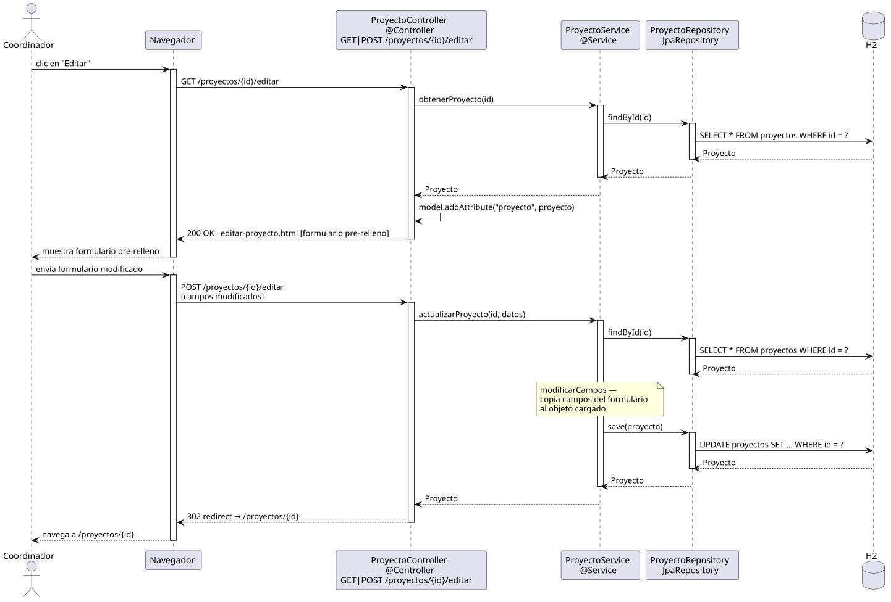

# editarProyecto — Diseño

## Información del artefacto

- **Proyecto**: FUNIBER GIPF
- **Fase RUP**: Elaboración
- **Disciplina**: Diseño
- **Actor**: Coordinador
- **Caso de uso**: editarProyecto()

## Propósito

Cargar un proyecto existente en un formulario pre-rellenado, aplicar las modificaciones del coordinador y persistir el resultado.

## Diagrama de secuencia

[Código PlantUML](../../../modelosUML/diseño/coordinador/editarProyecto.puml)

## Participantes

| Análisis | Spring Boot | Rol |
|---|---|---|
| Controlador de proyectos (GET) | ProyectoController @Controller GET /proyectos/{id}/editar | Carga el proyecto y sirve el formulario pre-relleno |
| Controlador de proyectos (POST) | ProyectoController @Controller POST /proyectos/{id}/editar | Recibe los campos modificados y persiste |
| Servicio de proyectos | ProyectoService @Service | `obtenerProyecto(id)` y `actualizarProyecto(id, datos)` |
| Repositorio de proyectos | ProyectoRepository JpaRepository | SELECT por id (GET) y UPDATE vía save(proyecto) (POST) |
| Base de datos | H2 | Almacén persistente |

## Rutas

| Método | URL | Acción |
|---|---|---|
| GET | /proyectos/{id}/editar | Muestra el formulario pre-relleno con los datos actuales |
| POST | /proyectos/{id}/editar | Guarda los campos modificados y redirige al detalle |

## Decisiones de diseño

- En el GET, `obtenerProyecto(id)` carga la entidad y se añade al modelo con `model.addAttribute("proyecto", proyecto)`.
- En el POST, `actualizarProyecto(id, datos)` hace primero `findById(id)` para cargar la entidad existente y luego copia campo a campo desde el formulario (nota `modificarCampos`), evitando sobrescribir campos no editables.
- Tras guardar, redirige a `/proyectos/{id}` (302 redirect) para mostrar el resultado actualizado.
