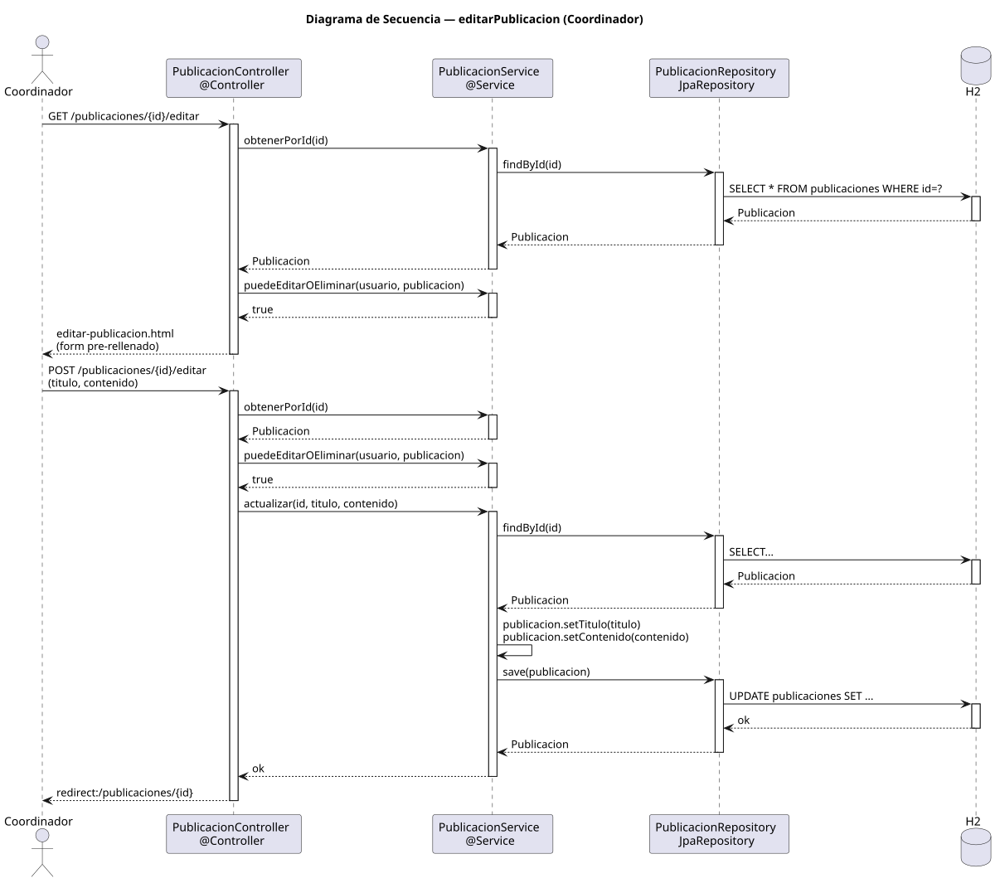

# editarPublicacion — Diseño

## Información del artefacto

- **Proyecto**: FUNIBER GIPF
- **Fase RUP**: Elaboración
- **Disciplina**: Diseño
- **Actor**: Coordinador
- **Caso de uso**: editarPublicacion()

## Propósito

Cargar una publicación existente en un formulario pre-rellenado, aplicar las modificaciones del coordinador y persistir el resultado.

## Diagrama de secuencia

[Código PlantUML](../../../modelosUML/diseño/coordinador/editarPublicacion.puml)

## Participantes

| Análisis | Spring Boot | Rol |
|---|---|---|
| Controlador de publicaciones (GET) | PublicacionController @Controller GET /publicaciones/{id}/editar | Verifica permisos y sirve el formulario pre-relleno |
| Controlador de publicaciones (POST) | PublicacionController @Controller POST /publicaciones/{id}/editar | Verifica permisos, aplica cambios y redirige |
| Servicio de publicaciones | PublicacionService @Service | `obtenerPorId(id)`, `puedeEditarOEliminar(usuario, publicacion)` y `actualizar(id, titulo, contenido)` |
| Repositorio de publicaciones | PublicacionRepository JpaRepository | SELECT por id y UPDATE vía save(publicacion) |
| Base de datos | H2 | Almacén persistente |

## Rutas

| Método | URL | Acción |
|---|---|---|
| GET | /publicaciones/{id}/editar | Muestra el formulario pre-rellenado (titulo, contenido) |
| POST | /publicaciones/{id}/editar | Aplica los cambios y redirige al detalle |

## Decisiones de diseño

- Tanto en GET como en POST, el controlador llama a `puedeEditarOEliminar(usuario, publicacion)` antes de actuar; si devuelve `false`, se redirige o devuelve 403.
- `actualizar(id, titulo, contenido)` hace `findById`, aplica `publicacion.setTitulo(titulo)` y `publicacion.setContenido(contenido)`, y luego `save(publicacion)`.
- Tras guardar, redirige a `redirect:/publicaciones/{id}` (302).
