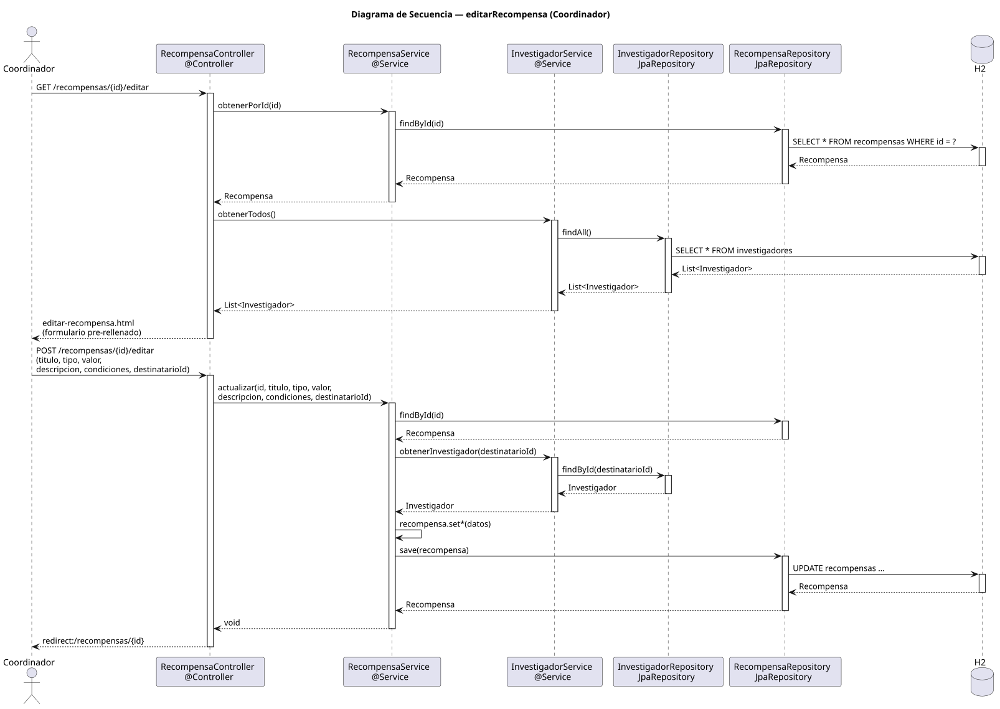

# editarRecompensa — Diseño

## Información del artefacto

- **Proyecto**: FUNIBER GIPF
- **Fase RUP**: Elaboración
- **Disciplina**: Diseño
- **Actor**: Coordinador
- **Caso de uso**: editarRecompensa()

## Propósito

Presentar un formulario pre-rellenado con los datos actuales de una recompensa para que el coordinador los modifique y los guarde.

## Diagrama de secuencia

[Código PlantUML](../../../modelosUML/diseño/coordinador/editarRecompensa.puml)

## Participantes

| Análisis | Spring Boot | Rol |
|---|---|---|
| Controlador de recompensas (GET) | RecompensaController @Controller GET /recompensas/{id}/editar | Carga la recompensa y la lista de investigadores |
| Controlador de recompensas (POST) | RecompensaController @Controller POST /recompensas/{id}/editar | Persiste los cambios |
| Servicio de recompensas | RecompensaService @Service | `obtenerPorId(id)` y `actualizar(id, titulo, tipo, valor, descripcion, condiciones, destinatarioId)` |
| Servicio de investigador | InvestigadorService @Service | `obtenerTodos()` en GET para el selector; `obtenerInvestigador(destinatarioId)` en el servicio POST |
| Repositorio de investigadores | InvestigadorRepository JpaRepository | findAll() y findById |
| Repositorio de recompensas | RecompensaRepository JpaRepository | SELECT por id y UPDATE via save(recompensa) |
| Base de datos | H2 | Almacén persistente |

## Rutas

| Método | URL | Acción |
|---|---|---|
| GET | /recompensas/{id}/editar | Muestra el formulario pre-rellenado con selector de investigadores |
| POST | /recompensas/{id}/editar | Persiste titulo, tipo, valor, descripcion, condiciones, destinatarioId y redirige |

## Decisiones de diseño

- El GET carga la recompensa con `obtenerPorId(id)` y todos los investigadores con `obtenerTodos()` para el selector.
- En el POST, `actualizar(...)` hace `findById(id)`, resuelve el nuevo destinatario con `obtenerInvestigador(destinatarioId)`, aplica los setters y llama a `save(recompensa)`.
- Tras guardar, redirige a `redirect:/recompensas/{id}` (302, PRG).
