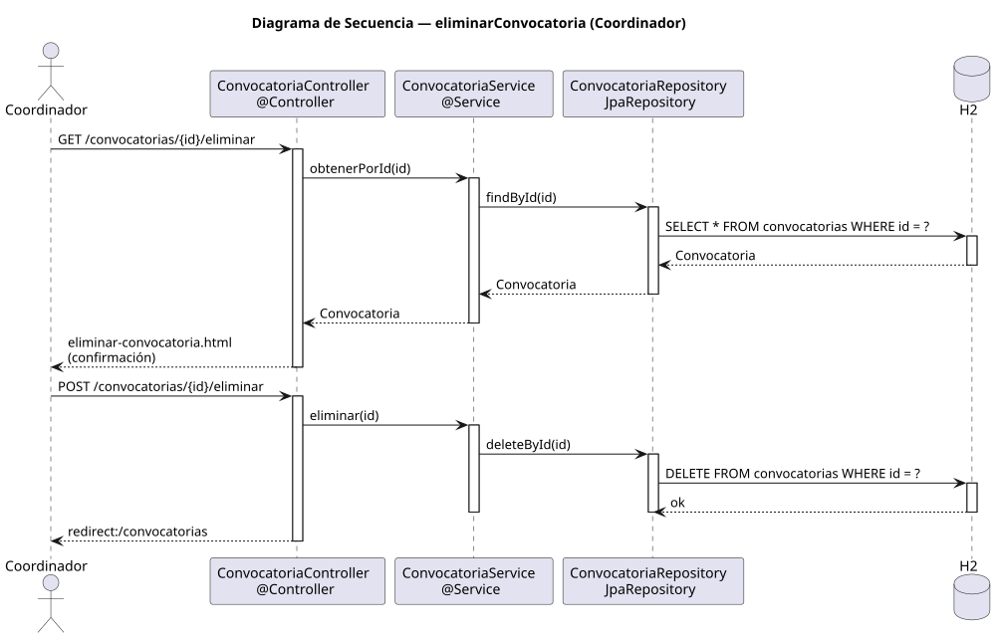

# eliminarConvocatoria — Diseño

## Información del artefacto

- **Proyecto**: FUNIBER GIPF
- **Fase RUP**: Elaboración
- **Disciplina**: Diseño
- **Actor**: Coordinador
- **Caso de uso**: eliminarConvocatoria()

## Propósito

Mostrar los datos de la convocatoria como pantalla de confirmación y borrarla definitivamente tras la acción del coordinador.

## Diagrama de secuencia

[Código PlantUML](../../../modelosUML/diseño/coordinador/eliminarConvocatoria.puml)

## Participantes

| Análisis | Spring Boot | Rol |
|---|---|---|
| Controlador de convocatorias (GET) | ConvocatoriaController @Controller GET /convocatorias/{id}/eliminar | Carga la convocatoria y muestra la confirmación |
| Controlador de convocatorias (POST) | ConvocatoriaController @Controller POST /convocatorias/{id}/eliminar | Ejecuta el borrado y redirige |
| Servicio de convocatorias | ConvocatoriaService @Service | `obtenerPorId(id)` y `eliminar(id)` |
| Repositorio de convocatorias | ConvocatoriaRepository JpaRepository | SELECT por id (GET) y DELETE via deleteById(id) (POST) |
| Base de datos | H2 | Almacén persistente |

## Rutas

| Método | URL | Acción |
|---|---|---|
| GET | /convocatorias/{id}/eliminar | Muestra la página de confirmación con título, área y estado |
| POST | /convocatorias/{id}/eliminar | Elimina la convocatoria y redirige al listado |

## Decisiones de diseño

- El GET carga la convocatoria con `obtenerPorId(id)` y la pasa a la vista de confirmación.
- El POST llama a `eliminar(id)` que ejecuta `deleteById(id)` directamente.
- Tras eliminar, redirige a `redirect:/convocatorias` (302).
