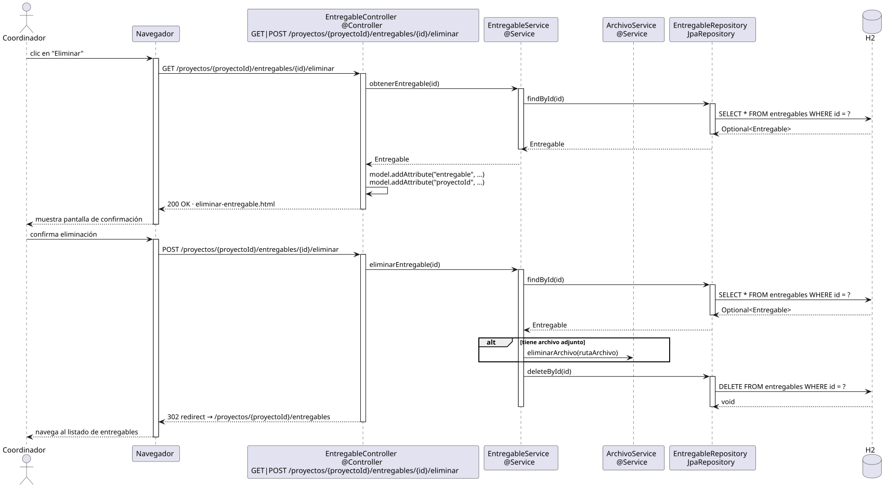

# eliminarEntregable — Diseño

## Información del artefacto

- **Proyecto**: FUNIBER GIPF
- **Fase RUP**: Elaboración
- **Disciplina**: Diseño
- **Actor**: Coordinador
- **Caso de uso**: eliminarEntregable()

## Propósito

Mostrar la confirmación de eliminación y borrar el entregable (y su archivo adjunto si existe) tras la confirmación del coordinador.

## Diagrama de secuencia

[Código PlantUML](../../../modelosUML/diseño/coordinador/eliminarEntregable.puml)

## Participantes

| Análisis | Spring Boot | Rol |
|---|---|---|
| Controlador de entregables (GET) | EntregableController @Controller GET /proyectos/{proyectoId}/entregables/{id}/eliminar | Carga el entregable y muestra la confirmación |
| Controlador de entregables (POST) | EntregableController @Controller POST /proyectos/{proyectoId}/entregables/{id}/eliminar | Elimina el entregable y su archivo si existe |
| Servicio de entregables | EntregableService @Service | `obtenerEntregable(id)` y `eliminarEntregable(id)` |
| Servicio de archivos | ArchivoService @Service | `eliminarArchivo(rutaArchivo)` si el entregable tiene archivo adjunto |
| Repositorio de entregables | EntregableRepository JpaRepository | SELECT por id y DELETE via deleteById(id) |
| Base de datos | H2 | Almacén persistente |

## Rutas

| Método | URL | Acción |
|---|---|---|
| GET | /proyectos/{proyectoId}/entregables/{id}/eliminar | Muestra la pantalla de confirmación |
| POST | /proyectos/{proyectoId}/entregables/{id}/eliminar | Elimina el entregable y redirige al listado |

## Decisiones de diseño

- En el GET, el entregable se carga con `obtenerEntregable(id)` y se añaden al modelo `"entregable"` y `"proyectoId"`.
- El POST llama a `eliminarEntregable(id)` que: primero hace `findById` para obtener la ruta del archivo; luego flujo alternativo `alt`: si tiene archivo adjunto → `ArchivoSvc.eliminarArchivo(rutaArchivo)`; finalmente `deleteById(id)`.
- Tras eliminar, redirige a `/proyectos/{proyectoId}/entregables` (302 redirect).
