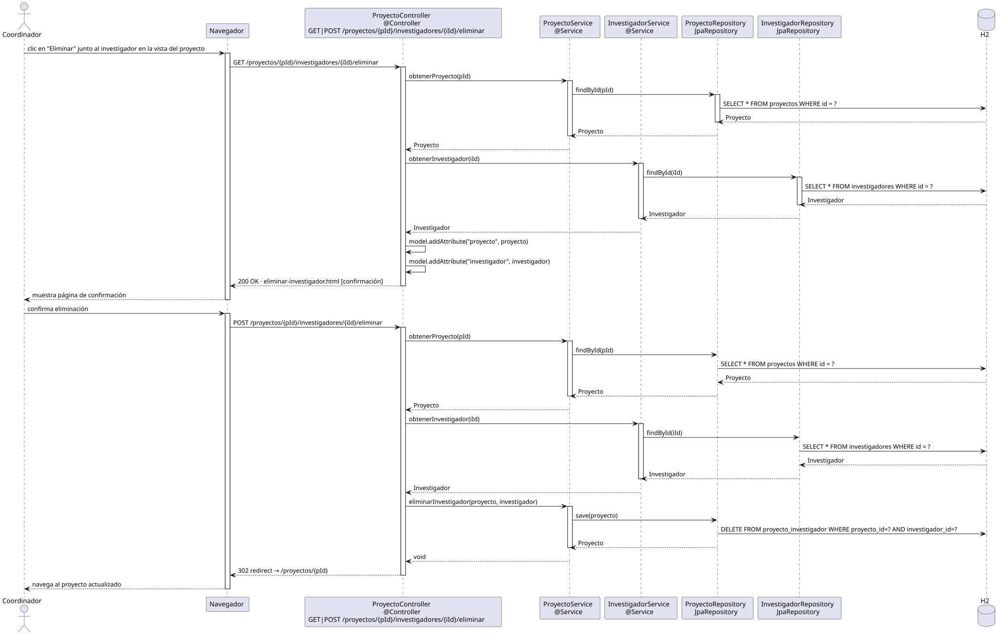

# eliminarInvestigador — Diseño

## Información del artefacto

- **Proyecto**: FUNIBER GIPF
- **Fase RUP**: Elaboración
- **Disciplina**: Diseño
- **Actor**: Coordinador
- **Caso de uso**: eliminarInvestigador()

## Propósito

Mostrar una página de confirmación antes de retirar a un investigador del equipo de un proyecto, y ejecutar la operación tras la confirmación. Solo se rompe la relación proyecto-investigador, no se elimina la entidad Investigador.

## Diagrama de secuencia

[Código PlantUML](../../../modelosUML/diseño/coordinador/eliminarInvestigador.puml)

## Participantes

| Análisis | Spring Boot | Rol |
|---|---|---|
| Controlador de proyectos (GET) | ProyectoController @Controller GET /proyectos/{pId}/investigadores/{iId}/eliminar | Carga proyecto e investigador y muestra confirmación |
| Controlador de proyectos (POST) | ProyectoController @Controller POST /proyectos/{pId}/investigadores/{iId}/eliminar | Ejecuta la retirada del investigador |
| Servicio de proyectos | ProyectoService @Service | `obtenerProyecto(pId)` y `eliminarInvestigador(proyecto, investigador)` |
| Servicio de investigador | InvestigadorService @Service | `obtenerInvestigador(iId)` carga el investigador |
| Repositorio de proyectos | ProyectoRepository JpaRepository | SELECT por pId y UPDATE via save (DELETE en proyecto_investigador) |
| Repositorio de investigadores | InvestigadorRepository JpaRepository | SELECT por iId via findById |
| Base de datos | H2 | Almacén persistente |

## Rutas

| Método | URL | Acción |
|---|---|---|
| GET | /proyectos/{pId}/investigadores/{iId}/eliminar | Muestra la confirmación con datos del proyecto e investigador |
| POST | /proyectos/{pId}/investigadores/{iId}/eliminar | Retira al investigador del proyecto y redirige |

## Decisiones de diseño

- El GET carga tanto el proyecto (`pId`) como el investigador (`iId`) para mostrar los nombres en la confirmación, no solo los ids. Ambos se añaden al modelo.
- El POST carga de nuevo proyecto e investigador y llama a `eliminarInvestigador(proyecto, investigador)` que ejecuta `remove` sobre la colección y `save`; JPA borra la fila de `proyecto_investigador`.
- Tras la confirmación, redirige a `/proyectos/{pId}` (302 redirect).
