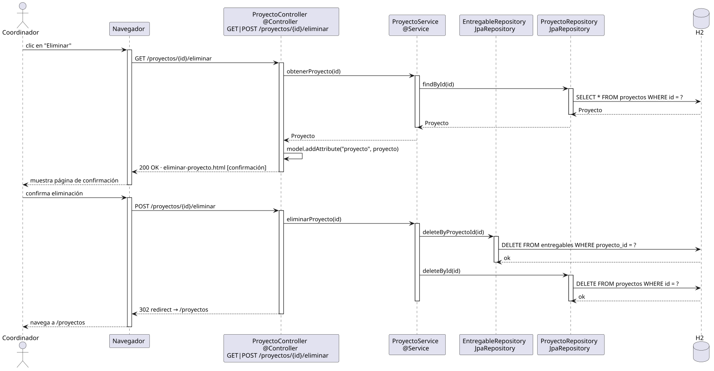

# eliminarProyecto — Diseño

## Información del artefacto

- **Proyecto**: FUNIBER GIPF
- **Fase RUP**: Elaboración
- **Disciplina**: Diseño
- **Actor**: Coordinador
- **Caso de uso**: eliminarProyecto()

## Propósito

Mostrar la ficha del proyecto a eliminar como pantalla de confirmación, y borrarlo definitivamente junto con sus entregables tras la confirmación del coordinador.

## Diagrama de secuencia

[Código PlantUML](../../../modelosUML/diseño/coordinador/eliminarProyecto.puml)

## Participantes

| Análisis | Spring Boot | Rol |
|---|---|---|
| Controlador de proyectos (GET) | ProyectoController @Controller GET /proyectos/{id}/eliminar | Carga el proyecto y muestra la confirmación |
| Controlador de proyectos (POST) | ProyectoController @Controller POST /proyectos/{id}/eliminar | Ejecuta la eliminación |
| Servicio de proyectos | ProyectoService @Service | `obtenerProyecto(id)` y `eliminarProyecto(id)` |
| Repositorio de entregables | EntregableRepository JpaRepository | Ejecuta DELETE FROM entregables WHERE proyecto_id = ? primero |
| Repositorio de proyectos | ProyectoRepository JpaRepository | Ejecuta DELETE FROM proyectos WHERE id = ? |
| Base de datos | H2 | Almacén persistente |

## Rutas

| Método | URL | Acción |
|---|---|---|
| GET | /proyectos/{id}/eliminar | Muestra la página de confirmación con los datos del proyecto |
| POST | /proyectos/{id}/eliminar | Elimina los entregables y el proyecto, y redirige a la lista |

## Decisiones de diseño

- En el GET, el proyecto se carga con `obtenerProyecto(id)` y se añade al modelo con `model.addAttribute("proyecto", proyecto)`.
- El POST llama a `eliminarProyecto(id)` que primero hace `EntregableRepository.deleteByProyectoId(id)` y luego `ProyectoRepository.deleteById(id)` para mantener la integridad referencial.
- Tras eliminar, redirige a `/proyectos` (302 redirect, patrón PRG).
