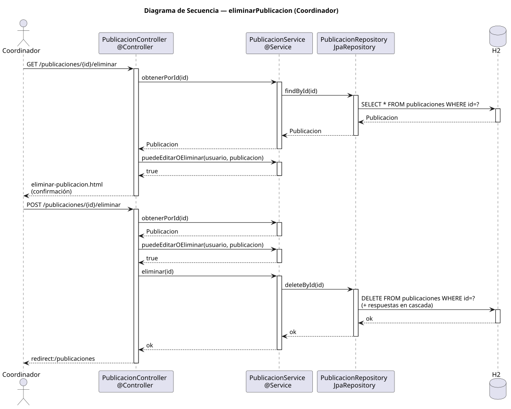

# eliminarPublicacion — Diseño

## Información del artefacto

- **Proyecto**: FUNIBER GIPF
- **Fase RUP**: Elaboración
- **Disciplina**: Diseño
- **Actor**: Coordinador
- **Caso de uso**: eliminarPublicacion()

## Propósito

Mostrar los datos de la publicación como pantalla de confirmación y borrarla definitivamente (con sus respuestas en cascada) tras la acción del coordinador.

## Diagrama de secuencia

[Código PlantUML](../../../modelosUML/diseño/coordinador/eliminarPublicacion.puml)

## Participantes

| Análisis | Spring Boot | Rol |
|---|---|---|
| Controlador de publicaciones (GET) | PublicacionController @Controller GET /publicaciones/{id}/eliminar | Verifica permisos y muestra la confirmación |
| Controlador de publicaciones (POST) | PublicacionController @Controller POST /publicaciones/{id}/eliminar | Verifica permisos y ejecuta el borrado |
| Servicio de publicaciones | PublicacionService @Service | `obtenerPorId(id)`, `puedeEditarOEliminar(usuario, publicacion)` y `eliminar(id)` |
| Repositorio de publicaciones | PublicacionRepository JpaRepository | SELECT por id y DELETE via deleteById(id); respuestas se eliminan en cascada |
| Base de datos | H2 | Almacén persistente |

## Rutas

| Método | URL | Acción |
|---|---|---|
| GET | /publicaciones/{id}/eliminar | Muestra la página de confirmación con los datos de la publicación |
| POST | /publicaciones/{id}/eliminar | Elimina la publicación (+ respuestas en cascada) y redirige al listado |

## Decisiones de diseño

- Tanto en GET como en POST, se verifica `puedeEditarOEliminar(usuario, publicacion)` antes de actuar.
- `eliminar(id)` llama a `deleteById(id)`; las respuestas se eliminan en cascada por la configuración de la entidad.
- Tras eliminar, redirige a `redirect:/publicaciones` (302).
