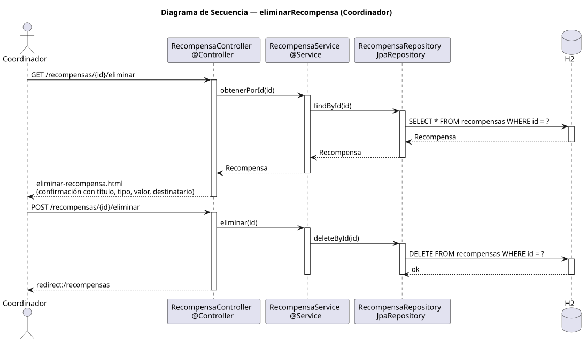

# eliminarRecompensa — Diseño

## Información del artefacto

- **Proyecto**: FUNIBER GIPF
- **Fase RUP**: Elaboración
- **Disciplina**: Diseño
- **Actor**: Coordinador
- **Caso de uso**: eliminarRecompensa()

## Propósito

Mostrar una pantalla de confirmación y, si el coordinador confirma, eliminar la recompensa del sistema.

## Diagrama de secuencia

[Código PlantUML](../../../modelosUML/diseño/coordinador/eliminarRecompensa.puml)

## Participantes

| Análisis | Spring Boot | Rol |
|---|---|---|
| Controlador de recompensas (GET) | RecompensaController @Controller GET /recompensas/{id}/eliminar | Carga la recompensa y muestra la confirmación |
| Controlador de recompensas (POST) | RecompensaController @Controller POST /recompensas/{id}/eliminar | Elimina la recompensa y redirige |
| Servicio de recompensas | RecompensaService @Service | `obtenerPorId(id)` y `eliminar(id)` |
| Repositorio de recompensas | RecompensaRepository JpaRepository | SELECT por id (GET) y DELETE via deleteById(id) (POST) |
| Base de datos | H2 | Almacén persistente |

## Rutas

| Método | URL | Acción |
|---|---|---|
| GET | /recompensas/{id}/eliminar | Muestra la pantalla de confirmación con título, tipo, valor y destinatario |
| POST | /recompensas/{id}/eliminar | Elimina la recompensa y redirige al listado |

## Decisiones de diseño

- El GET carga la recompensa con `obtenerPorId(id)` y la muestra en la vista de confirmación.
- El POST llama a `eliminar(id)` que ejecuta `deleteById(id)`.
- Tras eliminar, redirige a `redirect:/recompensas` (302).
