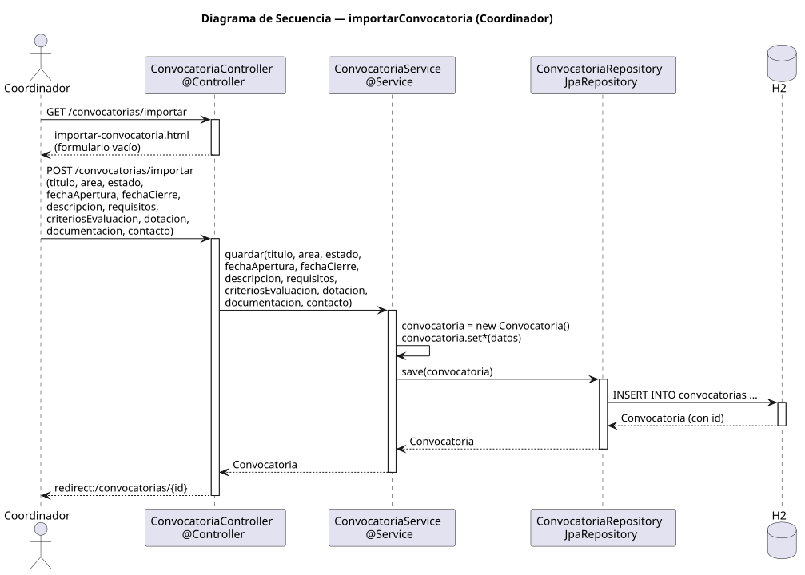

# importarConvocatoria — Diseño

## Información del artefacto

- **Proyecto**: FUNIBER GIPF
- **Fase RUP**: Elaboración
- **Disciplina**: Diseño
- **Actor**: Coordinador
- **Caso de uso**: importarConvocatoria()

## Propósito

Presentar un formulario vacío para que el coordinador registre manualmente una nueva convocatoria y persistirla en el sistema.

## Diagrama de secuencia

[Código PlantUML](../../../modelosUML/diseño/coordinador/importarConvocatoria.puml)

## Participantes

| Análisis | Spring Boot | Rol |
|---|---|---|
| Controlador de convocatorias (GET) | ConvocatoriaController @Controller GET /convocatorias/importar | Sirve el formulario vacío |
| Controlador de convocatorias (POST) | ConvocatoriaController @Controller POST /convocatorias/importar | Persiste la nueva convocatoria |
| Servicio de convocatorias | ConvocatoriaService @Service | `guardar(titulo, area, estado, fechaApertura, fechaCierre, descripcion, requisitos, criteriosEvaluacion, dotacion, documentacion, contacto)` |
| Repositorio de convocatorias | ConvocatoriaRepository JpaRepository | Ejecuta INSERT INTO convocatorias vía save(convocatoria) |
| Base de datos | H2 | Almacén persistente |

## Rutas

| Método | URL | Acción |
|---|---|---|
| GET | /convocatorias/importar | Muestra el formulario de importación vacío |
| POST | /convocatorias/importar | Persiste la nueva convocatoria con todos sus campos |

## Decisiones de diseño

- El servicio instancia `new Convocatoria()`, aplica todos los setters con los datos del POST y llama a `save(convocatoria)`.
- Los campos del POST son: titulo, area, estado, fechaApertura, fechaCierre, descripcion, requisitos, criteriosEvaluacion, dotacion, documentacion, contacto.
- Tras guardar, redirige a `redirect:/convocatorias/{id}` con el id de la convocatoria recién creada (302, PRG).
