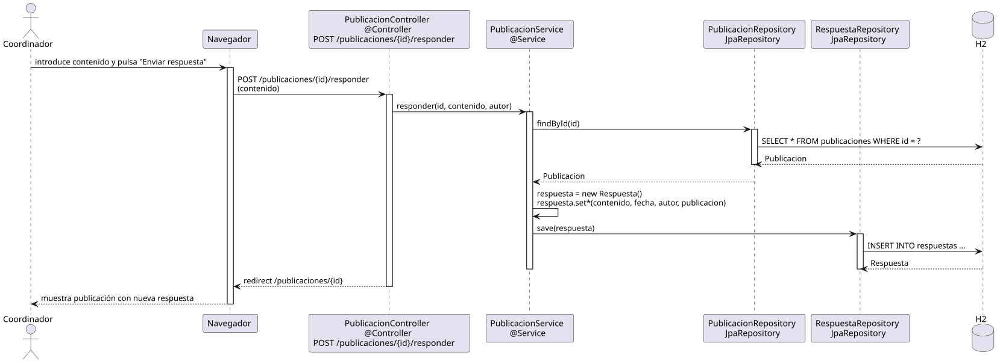

# responderPublicacion — Diseño

## Información del artefacto

- **Proyecto**: FUNIBER GIPF
- **Fase RUP**: Elaboración
- **Disciplina**: Diseño
- **Actor**: Coordinador
- **Caso de uso**: responderPublicacion()

## Propósito

Registrar una respuesta de texto a una publicación existente. El formulario está embebido en la vista de la publicación.

## Diagrama de secuencia

[Código PlantUML](../../../modelosUML/diseño/coordinador/responderPublicacion.puml)

## Participantes

| Análisis | Spring Boot | Rol |
|---|---|---|
| Controlador de publicaciones | PublicacionController @Controller | Atiende POST /publicaciones/{id}/responder y redirige |
| Servicio de publicaciones | PublicacionService @Service | `responder(id, contenido, autor)` crea y guarda la Respuesta |
| Repositorio de publicaciones | PublicacionRepository JpaRepository | SELECT * FROM publicaciones WHERE id = ? para cargar la publicacion padre |
| Repositorio de respuestas | RespuestaRepository JpaRepository | Ejecuta INSERT INTO respuestas via save(respuesta) |
| Base de datos | H2 | Almacén persistente |

## Rutas

| Método | URL | Acción |
|---|---|---|
| POST | /publicaciones/{id}/responder | Guarda la respuesta (contenido) y redirige a GET /publicaciones/{id} |

## Decisiones de diseño

- El servicio instancia `new Respuesta()` y le asigna: contenido, fecha (`LocalDate.now()`), autor y publicacion.
- El autor se obtiene del `@AuthenticationPrincipal`; no viene del formulario.
- Tras guardar, redirige a GET /publicaciones/{id} (patrón Post/Redirect/Get).
