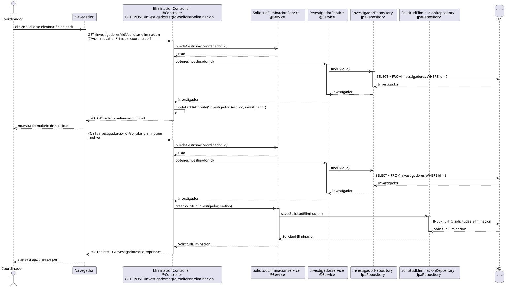

# solicitarEliminacionPerfil — Diseño

## Información del artefacto

- **Proyecto**: FUNIBER GIPF
- **Fase RUP**: Elaboración
- **Disciplina**: Diseño
- **Actor**: Coordinador
- **Caso de uso**: solicitarEliminacionPerfil()

## Propósito

Presentar el formulario de solicitud de eliminación de perfil y registrar la solicitud para el investigador indicado. El coordinador accede desde las opciones de perfil de ese investigador.

## Diagrama de secuencia

[Código PlantUML](../../../modelosUML/diseño/coordinador/solicitarEliminacionPerfil.puml)

## Participantes

| Análisis | Spring Boot | Rol |
|---|---|---|
| Controlador de eliminación (GET) | EliminacionController @Controller GET /investigadores/{id}/solicitar-eliminacion | Verifica permisos y sirve el formulario |
| Controlador de eliminación (POST) | EliminacionController @Controller POST /investigadores/{id}/solicitar-eliminacion | Verifica permisos, crea la solicitud y redirige |
| Servicio de solicitud de eliminación | SolicitudEliminacionService @Service | `puedeGestionar(coordinador, id)` y `crearSolicitud(investigador, motivo)` |
| Servicio de investigador | InvestigadorService @Service | `obtenerInvestigador(id)` carga el investigador destino |
| Repositorio de investigadores | InvestigadorRepository JpaRepository | SELECT * FROM investigadores WHERE id = ? |
| Repositorio de solicitudes | SolicitudEliminacionRepository JpaRepository | INSERT INTO solicitudes_eliminacion vía save(SolicitudEliminacion) |
| Base de datos | H2 | Almacén persistente |

## Rutas

| Método | URL | Acción |
|---|---|---|
| GET | /investigadores/{id}/solicitar-eliminacion | Muestra el formulario de solicitud de eliminación |
| POST | /investigadores/{id}/solicitar-eliminacion | Persiste la solicitud con el motivo y redirige |

## Decisiones de diseño

- En GET y POST, se llama a `puedeGestionar(coordinador, id)` que devuelve `true` para el coordinador sin restricción de id.
- El modelo recibe `"investigadorDestino"` con los datos del investigador a eliminar.
- El POST llama a `crearSolicitud(investigador, motivo)` que guarda la solicitud con estado PENDIENTE.
- Tras el POST, redirige a `/investigadores/{id}/opciones` (302).
