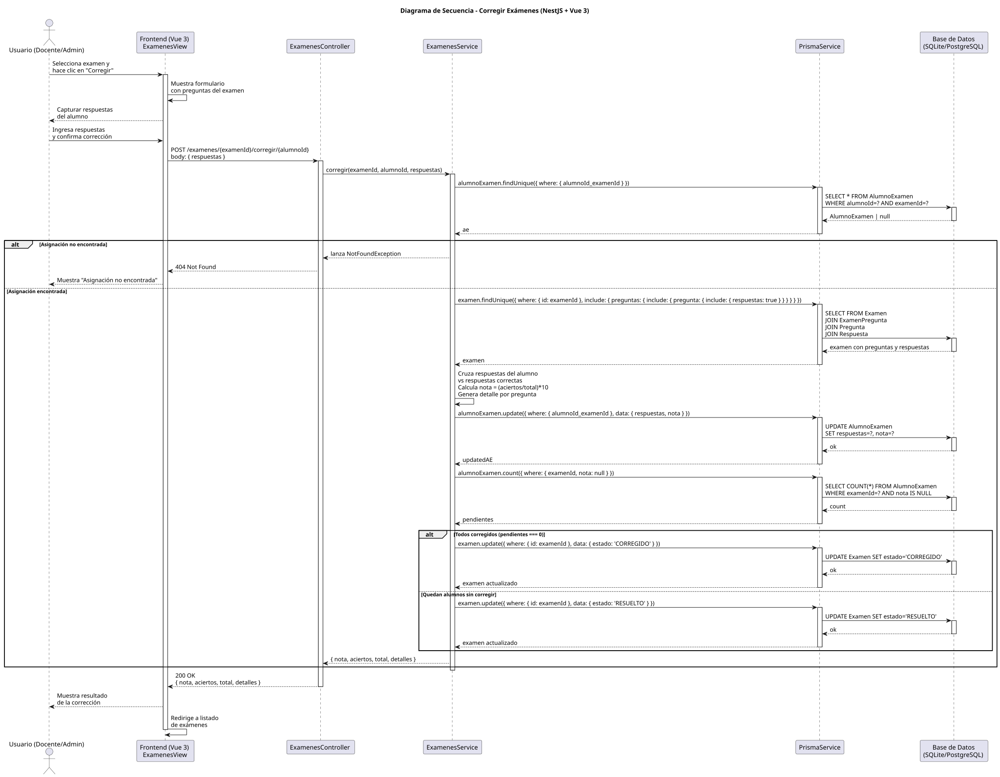

# 25-26-idsw2-sdVC > corregirExamenes > Diseño

## Información del artefacto

| Campo | Valor |
|-------|-------|
| **Proyecto** | Sistema de Gestión de Exámenes Universitarios |
| **Fase RUP** | Elaboración |
| **Disciplina** | Diseño |
| **Versión** | 1.0 (NestJS + Vue 3) |
| **Fecha** | 2026-06-03 |
| **Autor** | Marcos Gutierrez |

## Propósito

Detallar la interacción entre los componentes del sistema (Frontend Vue 3, ExamenesController, ExamenesService, PrismaService) para corregir las respuestas de un alumno en un examen, calcular la nota y actualizar el estado del examen.

## Diagrama de secuencia de diseño

||
|-|
|Código fuente: [secuencia.puml](../../../modelosUML/diseño/corregirExamenes/secuencia.puml)|

## Participantes

| Componente | Responsabilidad |
|---|---|
| **Frontend (Vue 3)** | ExamenesView que muestra el listado de exámenes, permite seleccionar un examen, capturar las respuestas del alumno, enviar la corrección al backend y mostrar el resultado (nota, aciertos, detalles). |
| **ExamenesController** | Endpoint REST `POST /examenes/:examenId/corregir/:alumnoId` que recibe la petición de corrección con las respuestas del alumno. |
| **ExamenesService** | Lógica de negocio para cruzar respuestas, calcular la nota, persistir la corrección y actualizar el estado del examen según el progreso de corrección. |
| **PrismaService** | Capa ORM que abstrae el acceso a la base de datos. Proporciona métodos para consultar y persistir exámenes, preguntas, respuestas y asignaciones. |
| **Base de Datos (SQLite/PostgreSQL)** | Almacena exámenes, preguntas, respuestas correctas, asignaciones alumno-examen y resultados de corrección. |

## Decisiones de diseño

| Decisión | Justificación |
|---|---|
| **Lógica de corrección en el backend** | Centralizar el cruce de respuestas y cálculo de nota en ExamenesService garantiza integridad y evita manipulación desde el cliente. |
| **Cálculo de nota proporcional** | `nota = (aciertos / total) * 10` con escala 0–10, estándar académico universitario. |
| **Transición automática de estado** | El examen transiciona a `RESUELTO` mientras queden alumnos sin corregir, y a `CORREGIDO` cuando todos han sido procesados. |
| **Almacenamiento de respuestas como JSON** | Las respuestas del alumno se guardan como JSON en `AlumnoExamen.respuestas` para preservar el histórico de la corrección. |
| **Validación de asignación existente** | Se verifica que el `AlumnoExamen` exista antes de corregir, evitando correcciones sobre asignaciones inexistentes. |
| **Detalle por pregunta** | Se devuelve un array `detalles` con `preguntaId`, `enunciado`, `respuestaCorrecta`, `respuestaAlumno` y `esCorrecto` para feedback al docente. |
| **Seguridad por capas** | `JwtAuthGuard` + `RolesGuard` protegen el endpoint. Solo usuarios con rol `DOCENTE` o `ADMIN` pueden corregir. |
| **Prisma ORM como capa de persistencia** | Abstrae el dialecto SQL (SQLite en desarrollo, PostgreSQL en producción) y proporciona tipado fuerte con TypeScript. |
