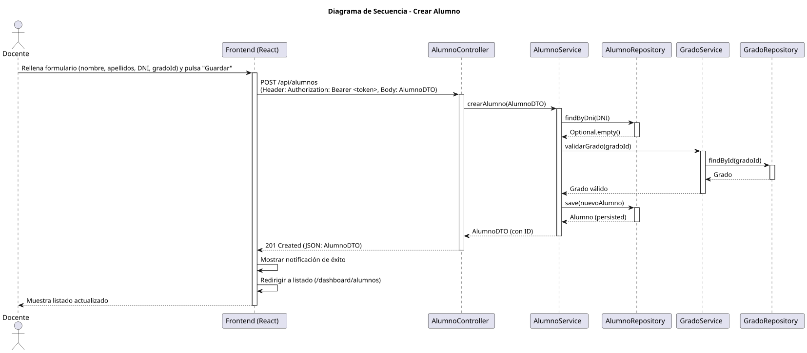

# Jorgestor > crearAlumno > Diseño

> |[🏠️](/documents/diseño/README.md)|[📊](../../../archivosEsenciales/casos-de-uso/diagramasDeContexto/diagramaDeContextoDocente/diagramaContexto.svg)|[Análisis](/documents/analisis/crearAlumno/README.md)|**Diseño**|Desarrollo|Pruebas|
> |-|-|-|-|-|-|

## Información del artefacto

- **Proyecto**: Jorgestor - Sistema de Gestión de Exámenes
- **Fase RUP**: Elaboración
- **Disciplina**: Diseño
- **Versión**: 1.0
- **Fecha**: 2026-06-03
- **Autor**: Gemini CLI

## Propósito

Detallar la implementación técnica de la creación de alumnos por parte del Docente. Se aplica el patrón "El Delgado" para una creación rápida y vinculación con un Grado existente.

## Diagrama de secuencia de diseño

||
|-|
|[Código PlantUML](../../../modelosUML/diseño/crearAlumno/secuencia.puml)|

## Participantes

- **Frontend (React)**: Componente `AlumnoCreate.tsx` que gestiona el formulario de alta y la selección del Grado.
- **AlumnoController**: Endpoint `POST /api/alumnos` protegido por `@PreAuthorize("hasRole('DOCENTE')")`.
- **AlumnoService**: Lógica de negocio para verificar la unicidad del DNI del alumno, validar la existencia del Grado a través de `GradoService` y persistir la entidad.
- **AlumnoRepository**: Interface para la persistencia en base de datos de los alumnos.
- **GradoService**: Servicio responsable de las operaciones sobre grados.
- **AlumnoDTO**: Estructura de datos para la transferencia desde la vista.

## Decisiones de diseño

- **Validación de Unicidad**: El servicio verifica que el DNI del alumno no esté registrado previamente.
- **Vinculación con Grado**: El alumno se asocia obligatoriamente a un Grado mediante su ID. El servicio valida la existencia del Grado a través de `GradoService`.
- **Seguridad**: Solo usuarios con el rol `ROLE_DOCENTE` pueden crear alumnos.
- **Flujo de Usuario**: Tras la creación, el sistema redirige al listado general de alumnos (`AlumnoList`) con un mensaje de éxito.
- **Patrón de Creación**: Se utiliza el patrón "El Delgado", permitiendo la creación desde el listado y retornando a él tras completar la acción.
