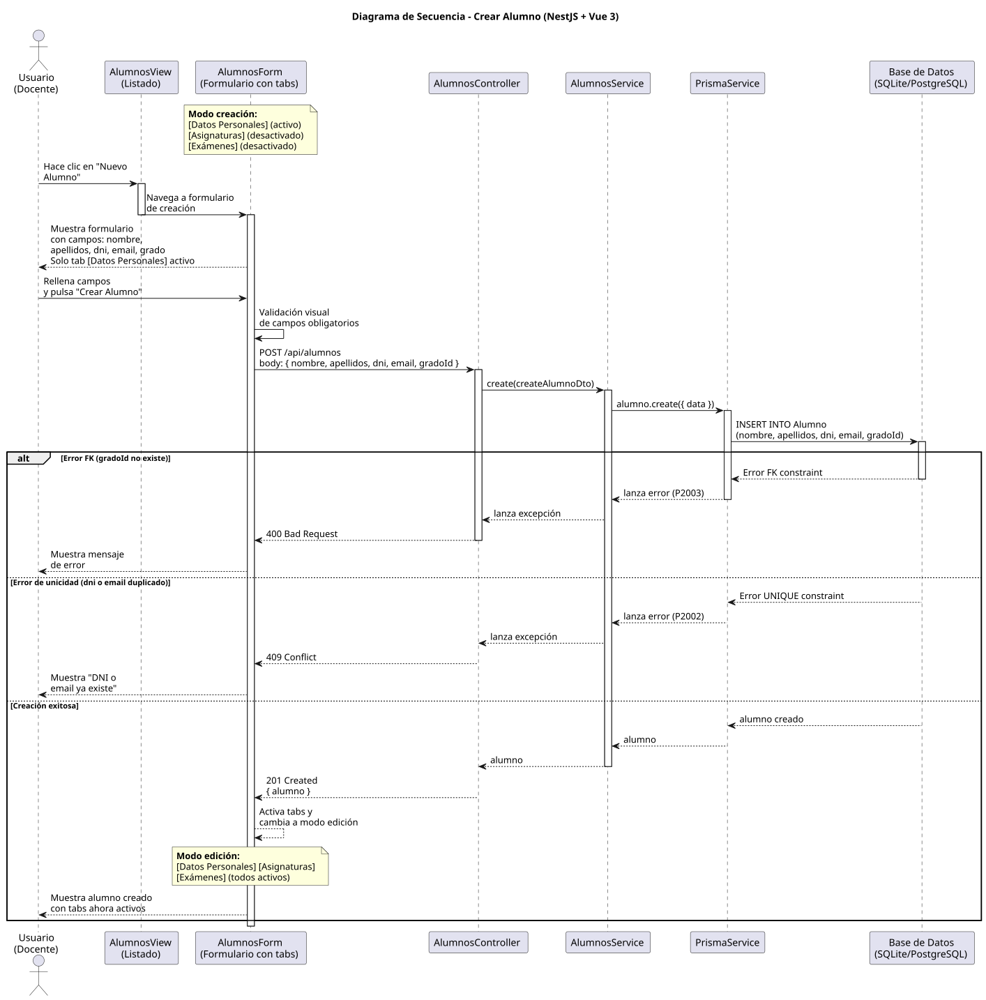

# 25-26-idsw2-sdVC > crearAlumno > Diseño

## Información del artefacto

| Campo | Valor |
|-------|-------|
| **Proyecto** | Sistema de Gestión de Exámenes Universitarios |
| **Fase RUP** | Elaboración |
| **Disciplina** | Diseño |
| **Versión** | 1.0 (NestJS + Vue 3) |
| **Fecha** | 2026-06-14 |
| **Autor** | Marcos Gutierrez |

## Propósito

Detallar la interacción entre los componentes del sistema para crear un nuevo alumno, con validación de FK a grado y unicidad de DNI/email gestionada por la base de datos mediante constraints.

## Diagrama de secuencia de diseño

||
|-|
|Código fuente: [secuencia.puml](../../../modelosUML/diseño/crearAlumno/secuencia.puml)|

## Participantes

| Componente | Responsabilidad |
|---|---|
| **AlumnosView (Listado)** | Vista que muestra el listado de alumnos. El usuario hace clic en "Nuevo Alumno" para navegar al formulario de creación. |
| **AlumnosForm (Formulario con tabs)** | Formulario con tabs: [Datos Personales] (activo), [Asignaturas] (desactivado), [Exámenes] (desactivado). En modo creación solo el tab de Datos Personales está disponible. Tras crear, cambia a modo edición con todos los tabs activos. |
| **AlumnosController** | Endpoint REST `POST /api/alumnos` que recibe el `CreateAlumnoDto` y delega en el servicio. Guards `JwtAuthGuard` + `RolesGuard` protegen el endpoint. Permite `DOCENTE` y `ADMIN`. |
| **AlumnosService** | Método `create()` que persiste el alumno mediante Prisma sin lógica adicional. La validación de FK a grado y unicidad de DNI/email se delega a la base de datos. |
| **PrismaService** | Capa ORM que ejecuta `alumno.create()` con los datos del DTO. |
| **Base de Datos (SQLite/PostgreSQL)** | Almacena el alumno. Valida integridad referencial de `gradoId` (FK) y unicidad de `dni` y `email` mediante `UNIQUE constraint`. |

## Decisiones de diseño

| Decisión | Justificación |
|---|---|
| **Validación de grado delegada a FK de BD** | `AlumnosService.create()` no verifica explícitamente la existencia del grado. La constraint `@relation(fields: [gradoId], references: [id])` en Prisma garantiza la integridad referencial. Si `gradoId` no existe, Prisma lanza error P2003. |
| **DTO con class-validator** | `CreateAlumnoDto` usa decoradores `@IsString()`, `@IsEmail()`, `@IsInt()`, `@IsNotEmpty()` para validar tipos y obligatoriedad. NestJS aplica estas validaciones automáticamente antes de que el controlador procese la petición. |
| **Sin verificación explícita de unicidad** | Los campos `dni` y `email` tienen `@unique` en el schema de Prisma. No se realiza una consulta previa de verificación — la base de datos rechaza duplicados con error P2002 y el backend lo traduce a 409 Conflict. |
| **Endpoint accesible para DOCENTE y ADMIN** | El controlador tiene `@Roles(Rol.DOCENTE, Rol.ADMIN)`. Cualquier usuario autenticado con estos roles puede crear alumnos. |
| **Manejo de error FK vs unique** | El diseño contempla dos caminos de error diferenciados: P2003 (FK) → 400 Bad Request con mensaje "Grado no encontrado", y P2002 (unique) → 409 Conflict con mensaje "DNI o email ya existe". |
| **Transición automática al alumno creado** | Tras crear, la vista navega a la vista del alumno (edición) para que el docente pueda verificar o modificar los datos inmediatamente. |
| **Seguridad por capas** | `JwtAuthGuard` + `RolesGuard` protegen el endpoint. Primero se verifica la autenticación JWT, luego el rol (DOCENTE o ADMIN). |
| **Lógica centralizada en el servicio** | Aunque `create()` es un método trivial (una sola línea), está centralizado en `AlumnosService`, no en el controlador. Cualquier validación o transformación futura (ej. normalización de DNI) se añade en el servicio sin modificar el contrato de la API. |
