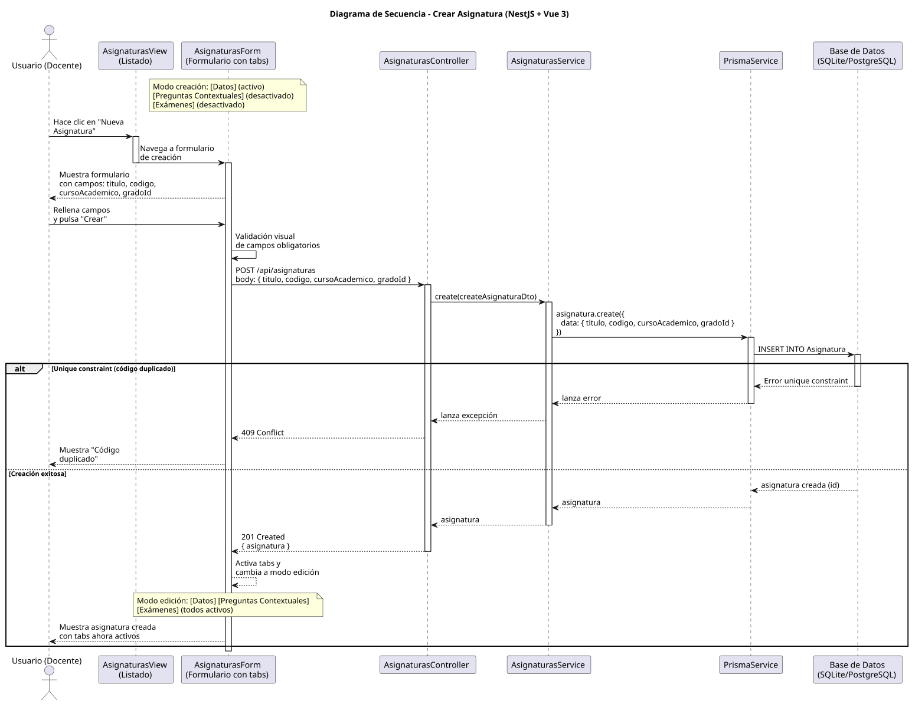

# 25-26-idsw2-sdVC > crearAsignatura > Diseño

## Información del artefacto

| Campo | Valor |
|-------|-------|
| **Proyecto** | Sistema de Gestión de Exámenes Universitarios |
| **Fase RUP** | Elaboración |
| **Disciplina** | Diseño |
| **Versión** | 1.0 (NestJS + Vue 3) |
| **Fecha** | 2026-06-09 |
| **Autor** | Marcos Gutierrez |

## Propósito

Detallar la interacción entre los componentes del sistema para crear una nueva asignatura con sus datos básicos (título, código, curso académico, grado asociado) y manejar restricciones de unicidad.

## Diagrama de secuencia de diseño

||
|-|
|Código fuente: [secuencia.puml](../../../modelosUML/diseño/crearAsignatura/secuencia.puml)|

## Participantes

| Componente | Responsabilidad |
|---|---|
| **AsignaturasView (Listado)** | Vista que muestra el listado de asignaturas. El usuario hace clic en "Nueva Asignatura" para navegar al formulario de creación. |
| **AsignaturasForm (Formulario con tabs)** | Formulario con tabs: [Datos] (activo), [Preguntas Contextuales] (desactivado), [Exámenes] (desactivado). En modo creación solo el tab de Datos está disponible. Tras crear, cambia a modo edición con todos los tabs activos. |
| **AsignaturasController** | Endpoint REST `POST /api/asignaturas` protegido por `JwtAuthGuard` + `RolesGuard`. |
| **AsignaturasService** | Método `create()` que persiste la asignatura mediante Prisma. |
| **PrismaService** | Capa ORM que ejecuta `asignatura.create()`. |
| **Base de Datos (SQLite/PostgreSQL)** | Almacena la asignatura. Valida unique constraint en `codigo`. |

## Decisiones de diseño

| Decisión | Justificación |
|---|---|
| **Validación visual en frontend** | El frontend valida campos obligatorios antes de enviar, evitando peticiones innecesarias. |
| **DTO con class-validator** | `CreateAsignaturaDto` valida tipos y formato en backend. |
| **Persistencia simple** | `AsignaturasService.create()` es directa — `prisma.asignatura.create()`. No crea batería automáticamente (según el análisis debería, pero la impl actual no lo hace). |
| **Manejo de error unique** | Si el código ya existe, Prisma lanza `P2002` que NestJS convierte en 409 Conflict. |
| **Transición a editarAsignatura** | Tras crear, la vista navega a `ASIGNATURA_ABIERTO` para editar/batería. |
| **Seguridad por capas** | Solo usuarios `DOCENTE` o `ADMIN` pueden crear asignaturas. |
| **Sin transaccionalidad explícita** | Operación atómica simple sin necesidad de transacción. |
| **Respuesta completa** | El endpoint devuelve la asignatura creada con su `id` generado. |
