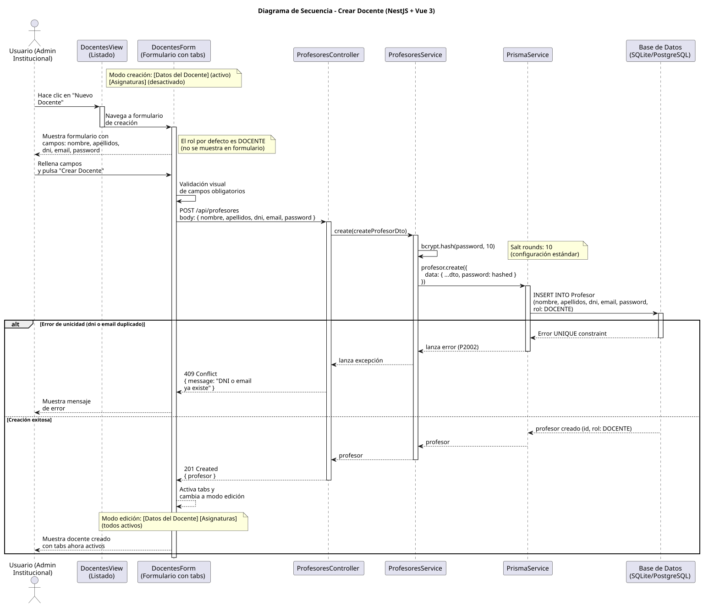

# 25-26-idsw2-sdVC > crearDocente > Diseño

## Información del artefacto

| Campo | Valor |
|-------|-------|
| **Proyecto** | Sistema de Gestión de Exámenes Universitarios |
| **Fase RUP** | Elaboración |
| **Disciplina** | Diseño |
| **Versión** | 1.0 (NestJS + Vue 3) |
| **Fecha** | 2026-06-14 |
| **Autor** | Marcos Gutierrez |

## Propósito

Detallar la interacción entre los componentes del sistema para crear un nuevo docente (profesor) en el sistema, con hashing de contraseña mediante bcrypt y validación de unicidad de DNI y email.

## Diagrama de secuencia de diseño

||
|-|
|Código fuente: [secuencia.puml](../../../modelosUML/diseño/crearDocente/secuencia.puml)|

## Participantes

| Componente | Responsabilidad |
|---|---|
| **DocentesView (Listado)** | Vista que muestra el listado de docentes. El usuario hace clic en "Nuevo Docente" para navegar al formulario de creación. |
| **DocentesForm (Formulario con tabs)** | Formulario con tabs: [Datos del Docente] (activo), [Asignaturas] (desactivado). En modo creación solo el tab de Datos del Docente está disponible. Tras crear, cambia a modo edición con todos los tabs activos. |
| **ProfesoresController** | Endpoint REST `POST /api/profesores` que recibe el `CreateProfesorDto` y delega en el servicio. Guards `JwtAuthGuard` + `RolesGuard` protegen el endpoint. Solo `ADMIN` puede crear docentes. |
| **ProfesoresService** | Método `create()` que hashea la contraseña con bcrypt (salt rounds 10) y persiste el profesor mediante Prisma. |
| **PrismaService** | Capa ORM que ejecuta `profesor.create()` con los datos del DTO y la contraseña hasheada. |

## Decisiones de diseño

| Decisión | Justificación |
|---|---|
| **Hashing con bcrypt (salt rounds 10)** | `ProfesoresService.create()` usa `bcrypt.hash(password, 10)` antes de persistir. El salt rounds 10 es el estándar de seguridad, balanceando coste computacional y protección contra ataques de fuerza bruta. |
| **DTO con class-validator** | `CreateProfesorDto` usa decoradores `@IsString()`, `@IsEmail()`, `@IsNotEmpty()` para validar tipos y obligatoriedad de campos. NestJS aplica estas validaciones automáticamente antes de que el controlador procese la petición. |
| **Rol DOCENTE por defecto** | El schema de Prisma define `rol` con `@default(DOCENTE)`. No se envía en el DTO — el administrador crea docentes, no administradores. |
| **Endpoint exclusivo para ADMIN** | El controlador tiene `@Roles(Rol.ADMIN)` en el endpoint `POST /profesores`. Solo administradores institucionales pueden crear docentes. |
| **Manejo de error de unicidad** | Si DNI o email ya existen, Prisma lanza `PrismaClientKnownRequestError` (código P2002). NestJS lo convierte en respuesta HTTP 409 Conflict. |
| **Transición automática a editarDocente** | Tras crear, la vista navega a `DOCENTE_ABIERTO` para que el administrador pueda editar los datos del docente inmediatamente. |
| **Seguridad por capas** | `JwtAuthGuard` + `RolesGuard` protegen el endpoint. Primero se verifica la autenticación JWT, luego el rol ADMIN. |
| **Hashing centralizado en el servicio** | La lógica de hashing está en `ProfesoresService.create()`, no en el controlador, siguiendo el principio de separación de responsabilidades (el controlador solo orquesta, el servicio ejecuta lógica de negocio). |
