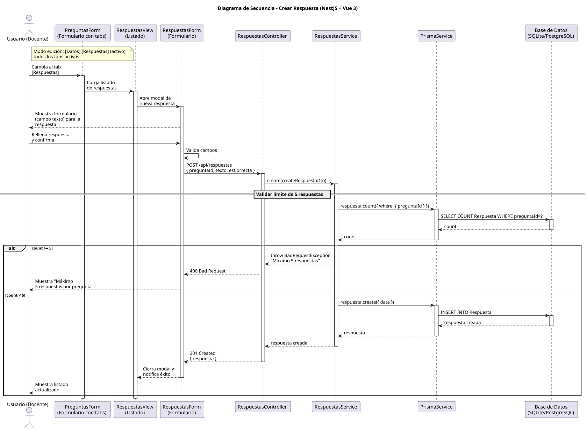

# 25-26-idsw2-sdVC > crearRespuesta > Diseño

## Información del artefacto

| Campo | Valor |
|-------|-------|
| **Proyecto** | Sistema de Gestión de Exámenes Universitarios |
| **Fase RUP** | Elaboración |
| **Disciplina** | Diseño |
| **Versión** | 1.0 (NestJS + Vue 3) |
| **Fecha** | 2026-06-09 |
| **Autor** | Marcos Gutierrez |

## Propósito

Crear una nueva respuesta asociada a una pregunta, con validación de límite máximo de 5 respuestas por pregunta.

## Diagrama de secuencia de diseño

||
|-|
|Código fuente: [secuencia.puml](../../../modelosUML/diseño/crearRespuesta/secuencia.puml)|

## Participantes

| Componente | Responsabilidad |
|---|---|
| **PreguntasForm (Formulario con tabs)** | Contexto de pregunta desde donde se gestionan las respuestas. Modo edición: [Datos] [Respuestas] (todos activos). |
| **RespuestasView (Listado)** | Vista que muestra el listado de respuestas de la pregunta actual. |
| **RespuestasForm (Formulario)** | Modal de creación de nueva respuesta. Validación visual antes de enviar. |
| **RespuestasController** | POST /api/respuestas. |
| **RespuestasService** | create() con validación de límite. |
| **PrismaService** | Capa ORM. |
| **Base de Datos** | Almacena respuestas. |

## Decisiones de diseño

| Decisión | Justificación |
|---|---|
| **Límite de 5 respuestas** | Regla de negocio validada en backend. |
| **Validación previa con count** | Evita crear respuestas que excedan el límite. |
| **DTO con preguntaId** | La respuesta se asocia a una pregunta existente. |
