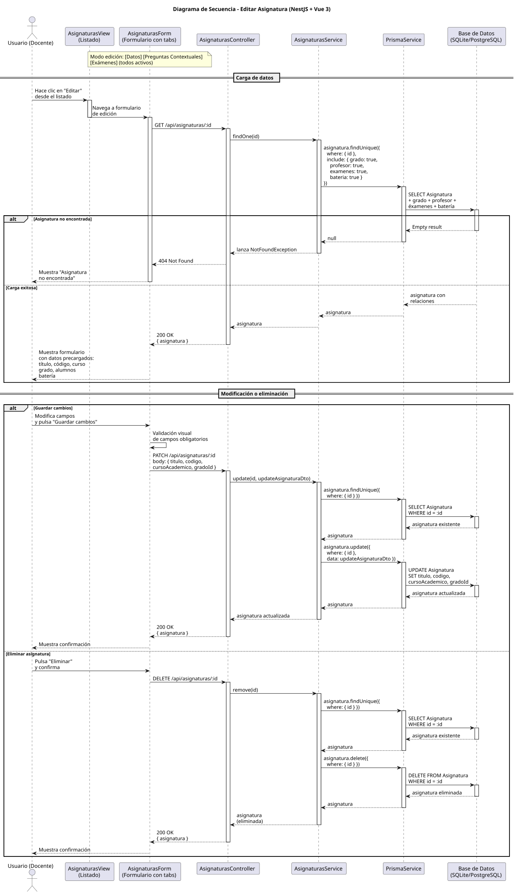

# 25-26-idsw2-sdVC > editarAsignatura > Diseño

## Información del artefacto

| Campo | Valor |
|-------|-------|
| **Proyecto** | Sistema de Gestión de Exámenes Universitarios |
| **Fase RUP** | Elaboración |
| **Disciplina** | Diseño |
| **Versión** | 1.0 (NestJS + Vue 3) |
| **Fecha** | 2026-06-14 |
| **Autor** | Marcos Gutierrez |

## Propósito

Detallar la interacción entre los componentes del sistema para editar una asignatura existente (modificar título, código, curso académico, grado) o eliminarla, con verificación de existencia antes de cualquier operación, carga previa de datos con relaciones (grado, profesor, exámenes, batería) y validación de campos en frontend.

## Diagrama de secuencia de diseño

||
|-|
|Código fuente: [secuencia.puml](../../../modelosUML/diseño/editarAsignatura/secuencia.puml)|

## Participantes

| Componente | Responsabilidad |
|---|---|
| **AsignaturasView (Listado)** | Vista que muestra el listado de asignaturas. El usuario hace clic en "Editar" para navegar al formulario de edición. |
| **AsignaturasForm (Formulario con tabs)** | Formulario con tabs: [Datos] [Preguntas Contextuales] [Exámenes] (todos activos en modo edición). Muestra datos precargados (título, código, curso, grado, batería), permite modificar, guardar, cancelar o eliminar. Validación visual antes de enviar. |
| **AsignaturasController** | Endpoints REST `GET /api/asignaturas/:id` (carga de datos), `PATCH /api/asignaturas/:id` (actualización) y `DELETE /api/asignaturas/:id` (eliminación). Guards `JwtAuthGuard` + `RolesGuard` protegen los endpoints. |
| **AsignaturasService** | Métodos `findOne()`, `update()` y `remove()` con verificación de existencia. |
| **PrismaService** | Capa ORM que ejecuta las consultas sobre el modelo Asignatura. |
| **Base de Datos (SQLite/PostgreSQL)** | Almacena y recupera los datos de la asignatura y sus relaciones. |

## Decisiones de diseño

| Decisión | Justificación |
|---|---|
| **Carga previa de datos antes de editar** | El frontend solicita `GET /asignaturas/:id` al abrir la edición para precargar todos los campos del formulario, incluyendo relaciones (grado, profesor, exámenes, batería). Esto permite al docente ver el estado actual completo antes de modificar. |
| **Verificación de existencia en update() y remove()** | Ambos métodos del servicio llaman a `findOne(id)` antes de operar. Si la asignatura fue eliminada entre la carga y la acción, se lanza `NotFoundException` (404). Esto evita errores crípticos de Prisma. |
| **Validación visual en frontend** | El frontend valida campos obligatorios antes de enviar el PATCH, evitando peticiones innecesarias al servidor. |
| **DTO con validación de NestJS** | `UpdateAsignaturaDto` usa `class-validator` para validar tipos y valores opcionales (permite PATCH parcial, solo actualizando los campos enviados). |
| **Eliminación con confirmación** | Antes de enviar el DELETE, el frontend solicita confirmación al docente. Esto evita eliminaciones accidentales. |
| **Seguridad por capas** | `JwtAuthGuard` + `RolesGuard` protegen los tres endpoints. Solo `DOCENTE` o `ADMIN` pueden editar o eliminar asignaturas. |
| **Include con relaciones en findOne()** | `findOne()` incluye `grado`, `profesor`, `examenes` y `bateria` mediante Prisma `include`. Esto permite mostrar todas las relaciones de la asignatura en el formulario de edición sin consultas adicionales. |
| **Sin transaccionalidad explícita** | Tanto `update()` como `remove()` son operaciones atómicas sobre una sola tabla que no requieren transacción. La verificación de existencia previa es suficiente para garantizar consistencia. |
