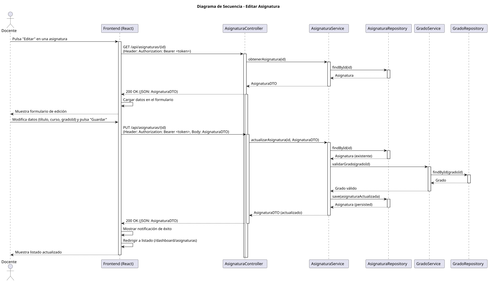

# Jorgestor > editarAsignatura > Diseño

> |[🏠️](/documents/diseño/README.md)|[📊](../../../archivosEsenciales/casos-de-uso/diagramasDeContexto/diagramaDeContextoDocente/diagramaContexto.svg)|[Análisis](/documents/analisis/editarAsignatura/README.md)|**Diseño**|Desarrollo|Pruebas|
> |-|-|-|-|-|-|

## Información del artefacto

- **Proyecto**: Jorgestor - Sistema de Gestión de Exámenes
- **Fase RUP**: Elaboración
- **Disciplina**: Diseño
- **Versión**: 1.0
- **Fecha**: 2026-06-03
- **Autor**: Gemini CLI

## Propósito

Detallar la implementación técnica de la edición de datos de una asignatura existente por parte del Docente. Se aplica el patrón "El Gordo" para permitir la edición integral de los campos (Título, Curso Académico, Grado vinculado).

## Diagrama de secuencia de diseño

||
|-|
|[Código PlantUML](../../../modelosUML/diseño/editarAsignatura/secuencia.puml)|

## Participantes

- **Frontend (React)**: Componente `AsignaturaEdit.tsx` que gestiona la carga de datos inicial y el formulario de modificación.
- **AsignaturaController**: Endpoints `GET /api/asignaturas/{id}` y `PUT /api/asignaturas/{id}` protegidos por `@PreAuthorize("hasRole('DOCENTE')")`.
- **AsignaturaService**: Lógica para recuperar la entidad, validar la existencia del nuevo Grado vinculado y persistir la actualización.
- **AsignaturaRepository**: Interface para interactuar con la persistencia de las asignaturas.
- **GradoRepository**: Interface para validar la existencia del grado si este es modificado.
- **AsignaturaDTO**: Clase para transferir los datos de la asignatura entre capas.

## Decisiones de diseño

- **Carga Previa**: Se realiza una petición GET inicial para asegurar que el usuario edita la versión más reciente de la asignatura.
- **Validación de Grado**: Si el Docente cambia el Grado de la asignatura, el servicio valida que el nuevo ID de Grado exista en la base de datos.
- **Integridad**: El servicio verifica la existencia de la asignatura antes de actualizar (`404 Not Found` si no existe).
- **Seguridad**: Solo usuarios con el rol `ROLE_DOCENTE` pueden realizar estas operaciones.
- **Flujo de Usuario**: Tras guardar los cambios, el sistema redirige al listado general para confirmar visualmente la actualización.
- **Patrón de Edición**: Se utiliza el patrón "El Gordo", permitiendo la edición de todos los campos visibles en una única operación.
