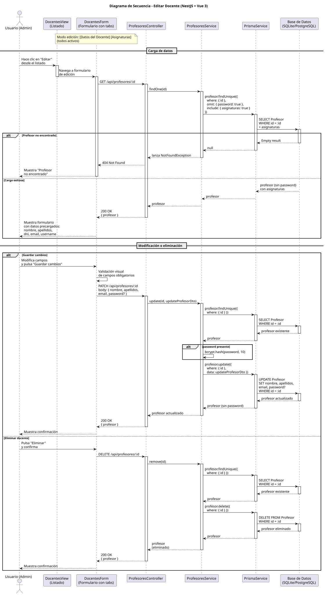

# 25-26-idsw2-sdVC > editarDocente > Diseño

## Información del artefacto

| Campo | Valor |
|-------|-------|
| **Proyecto** | Sistema de Gestión de Exámenes Universitarios |
| **Fase RUP** | Elaboración |
| **Disciplina** | Diseño |
| **Versión** | 1.0 (NestJS + Vue 3) |
| **Fecha** | 2026-06-14 |
| **Autor** | Marcos Gutierrez |

## Propósito

Detallar la interacción entre los componentes del sistema para editar un docente existente (modificar nombre, apellidos, email, contraseña opcional) o eliminarlo, con verificación de existencia antes de cualquier operación, carga previa de datos con asignaturas asociadas, hashing condicional de contraseña con bcrypt y validación de campos en frontend.

## Diagrama de secuencia de diseño

||
|-|
|Código fuente: [secuencia.puml](../../../modelosUML/diseño/editarDocente/secuencia.puml)|

## Participantes

| Componente | Responsabilidad |
|---|---|
| **DocentesView (Listado)** | Vista que muestra el listado de docentes. El usuario hace clic en "Editar" para navegar al formulario de edición. |
| **DocentesForm (Formulario con tabs)** | Formulario con tabs: [Datos del Docente] [Asignaturas] (todos activos en modo edición). Muestra datos precargados (nombre, apellidos, dni, email, username), permite modificar campos, cambiar contraseña opcionalmente, guardar cambios o eliminar. Validación visual antes de enviar. |
| **ProfesoresController** | Endpoints REST `GET /api/profesores/:id` (carga de datos), `PATCH /api/profesores/:id` (actualización) y `DELETE /api/profesores/:id` (eliminación). Guards `JwtAuthGuard` + `RolesGuard` protegen los endpoints, solo ADMIN. |
| **ProfesoresService** | Métodos `findOne()` (busca con `omit: { password: true }` e `include: { asignaturas: true }`), `update()` (verifica existencia vía `findOne()`, aplica `bcrypt.hash()` si hay nueva contraseña, y luego persiste con Prisma) y `remove()` (verifica existencia vía `findOne()` y luego elimina). |
| **PrismaService** | Capa ORM que ejecuta `profesor.findUnique()`, `profesor.update()` y `profesor.delete()` sobre el modelo Profesor. |
| **Base de Datos (SQLite/PostgreSQL)** | Almacena y recupera los datos del docente, incluyendo la contraseña cifrada y las asignaturas asociadas. |

## Decisiones de diseño

| Decisión | Justificación |
|---|---|
| **Carga previa de datos antes de editar** | El frontend solicita `GET /profesores/:id` al abrir la edición para precargar todos los campos del formulario, incluyendo asignaturas asociadas. Esto permite al administrador ver el estado actual completo antes de modificar. |
| **Verificación de existencia en update() y remove()** | Ambos métodos del servicio llaman a `findOne(id)` antes de operar. Si el docente fue eliminado entre la carga y la acción, se lanza `NotFoundException` (404). Esto evita errores crípticos de Prisma. |
| **Hashing condicional de contraseña con bcrypt** | `update()` solo aplica `bcrypt.hash(data.password, 10)` si el DTO incluye el campo `password`. Si no se envía, la contraseña existente se mantiene intacta. Esto permite actualizar otros campos sin tener que re-enviar la contraseña. |
| **Omisión de contraseña en respuestas** | `findOne()` y `update()` usan `omit: { password: true }` para nunca incluir el hash en las respuestas HTTP, incluso si la operación interna lo maneja. Esto protege la contraseña incluso en tránsito. |
| **Validación visual en frontend** | El frontend valida campos obligatorios antes de enviar el PATCH, evitando peticiones innecesarias al servidor. |
| **DTO con validación de NestJS** | `UpdateProfesorDto` usa `class-validator` para validar tipos y valores opcionales (permite PATCH parcial, solo actualizando los campos enviados, incluyendo la contraseña como opcional). |
| **Eliminación con confirmación** | Antes de enviar el DELETE, el frontend solicita confirmación al administrador. Esto evita eliminaciones accidentales de cuentas de docente. |
| **Seguridad por capas** | `JwtAuthGuard` + `RolesGuard` protegen los tres endpoints. Solo `ADMIN` puede editar o eliminar docentes. El acceso no autorizado devuelve 401/403. |

## Trazabilidad con la implementación

| Capa | Artefacto real |
|------|----------------|
| Controlador | `src/apps/backend/src/profesores/profesores.controller.ts` (`PATCH /profesores/:id`, `DELETE /profesores/:id`, `GET /profesores/:id`) |
| Servicio | `src/apps/backend/src/profesores/profesores.service.ts` (`update()`, `remove()`, `findOne()`) |
| DTO | `src/apps/backend/src/profesores/dto/update-profesor.dto.ts` (`UpdateProfesorDto`) |
| Vista | `src/apps/frontend/src/views/ProfesoresView.vue` (diálogo de edición) |
| Modelo (BD) | `src/apps/backend/prisma/schema.prisma` (modelo `Profesor`) |
