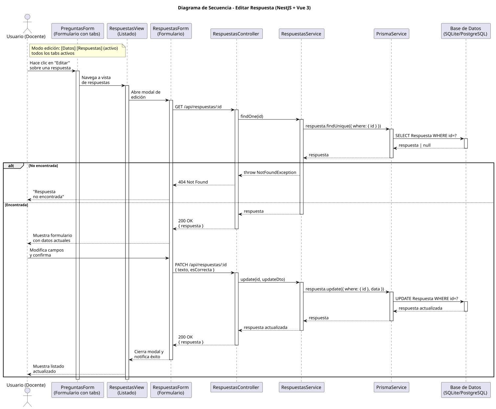

# 25-26-idsw2-sdVC > editarRespuesta > Diseño

## Información del artefacto

| Campo | Valor |
|-------|-------|
| **Proyecto** | Sistema de Gestión de Exámenes Universitarios |
| **Fase RUP** | Elaboración |
| **Disciplina** | Diseño |
| **Versión** | 1.0 (NestJS + Vue 3) |
| **Fecha** | 2026-06-09 |
| **Autor** | Marcos Gutierrez |

## Propósito

Editar el texto y/o la corrección de una respuesta existente.

## Diagrama de secuencia de diseño

||
|-|
|Código fuente: [secuencia.puml](../../../modelosUML/diseño/editarRespuesta/secuencia.puml)|

## Participantes

| Componente | Responsabilidad |
|---|---|
| **PreguntasForm (Formulario con tabs)** | Contexto de pregunta desde donde se gestionan las respuestas. Modo edición: [Datos] [Respuestas] (todos activos). |
| **RespuestasView (Listado)** | Vista que muestra el listado de respuestas de la pregunta actual. |
| **RespuestasForm (Formulario)** | Modal de edición precargado con datos de la respuesta. |
| **RespuestasController** | GET /api/respuestas/:id + PATCH /api/respuestas/:id. |
| **RespuestasService** | findOne() para precarga + update(). |
| **PrismaService** | Capa ORM. |
| **Base de Datos** | Almacena respuestas. |

## Decisiones de diseño

| Decisión | Justificación |
|---|---|
| **Precarga con GET** | Muestra datos actuales antes de editar. |
| **PATCH parcial** | Solo envía campos modificados. |
| **Verificación de existencia** | findOne previo lanza 404 si no existe. |
