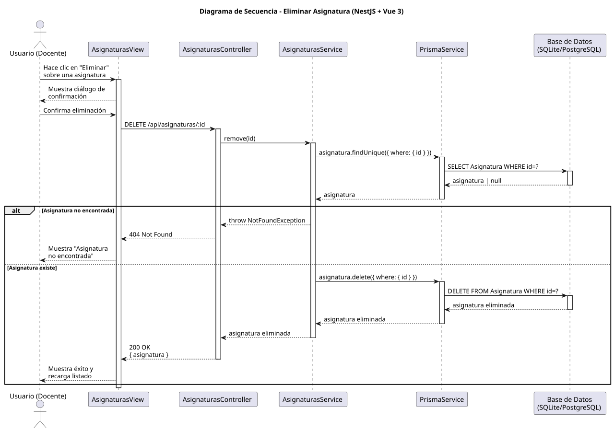

# 25-26-idsw2-sdVC > eliminarAsignatura > Diseño

## Información del artefacto

| Campo | Valor |
|-------|-------|
| **Proyecto** | Sistema de Gestión de Exámenes Universitarios |
| **Fase RUP** | Elaboración |
| **Disciplina** | Diseño |
| **Versión** | 1.0 (NestJS + Vue 3) |
| **Fecha** | 2026-06-09 |
| **Autor** | Marcos Gutierrez |

## Propósito

Eliminar una asignatura con confirmación previa, verificación de existencia y manejo de error 404.

## Diagrama de secuencia de diseño

||
|-|
|Código fuente: [secuencia.puml](../../../modelosUML/diseño/eliminarAsignatura/secuencia.puml)|

## Participantes

| Componente | Responsabilidad |
|---|---|
| **AsignaturasView** | Diálogo de confirmación. |
| **AsignaturasController** | DELETE /api/asignaturas/:id. |
| **AsignaturasService** | remove() con findOne previo. |
| **PrismaService** | Capa ORM. |
| **Base de Datos** | Almacena asignaturas. |

## Decisiones de diseño

| Decisión | Justificación |
|---|---|
| **Confirmación en frontend** | Diálogo antes de enviar DELETE. |
| **Verificación de existencia** | findOne previo lanza 404 si no existe. |
| **Eliminación en cascada** | Prisma elimina batería, exámenes y relaciones asociadas. |
| **Recarga de listado** | Tras eliminar, se recarga el listado. |
| **Seguridad por capas** | Solo `DOCENTE` o `ADMIN`. |
