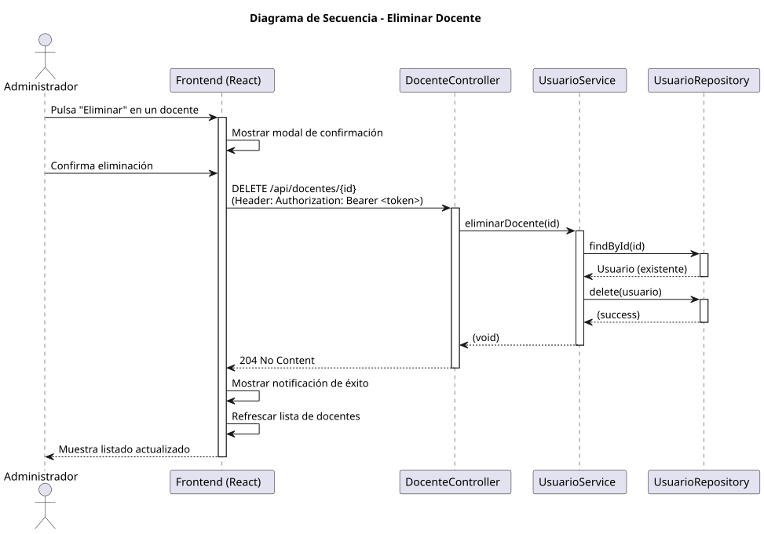

# Jorgestor > eliminarDocente > Diseño

> |[🏠️](/documents/diseño/README.md)|[📊](../../../archivosEsenciales/casos-de-uso/diagramasDeContexto/diagramaDeContextoAdministradorInstitucional/diagramaContexto.svg)|[Análisis](/documents/analisis/eliminarDocente/README.md)|**Diseño**|Desarrollo|Pruebas|
> |-|-|-|-|-|-|

## Información del artefacto

- **Proyecto**: Jorgestor - Sistema de Gestión de Exámenes
- **Fase RUP**: Elaboración
- **Disciplina**: Diseño
- **Versión**: 1.0
- **Fecha**: 2026-06-03
- **Autor**: Gemini CLI

## Propósito

Detallar la implementación técnica de la eliminación de un docente por parte del Administrador Institucional. Este proceso incluye una fase de confirmación previa en la interfaz de usuario para evitar borrados accidentales.

## Diagrama de secuencia de diseño

||
|-|
|[Código PlantUML](../../../modelosUML/diseño/eliminarDocente/secuencia.puml)|

## Participantes

- **Frontend (React)**: Componente `DocenteList.tsx` (o un modal auxiliar) que gestiona la interacción y la petición de borrado.
- **DocenteController**: Endpoint `DELETE /api/docentes/{id}` protegido por `@PreAuthorize("hasRole('ADMIN')")`.
- **UsuarioService**: Lógica para verificar la existencia del usuario y ejecutar la eliminación.
- **UsuarioRepository**: Interface para interactuar con la persistencia y eliminar el registro.

## Decisiones de diseño

- **Confirmación en UI**: Antes de realizar la petición al servidor, el frontend mostrará un cuadro de diálogo de confirmación.
- **Seguridad**: Solo usuarios con `ROLE_ADMIN` tienen permiso para eliminar usuarios del sistema.
- **Respuesta HTTP**: Se utilizará el código de estado `204 No Content` tras una eliminación exitosa, indicando que la acción se completó pero no hay datos que devolver.
- **Integridad Referencial**: El servicio debe asegurar que no existan dependencias críticas antes de borrar, o manejar la eliminación en cascada si fuera necesario (aunque en este contexto, un docente borrado simplemente deja de aparecer en los listados administrativos).
- **Refresco Visual**: Tras la eliminación, el listado de docentes se actualizará automáticamente eliminando la fila correspondiente sin necesidad de recargar la página completa.
