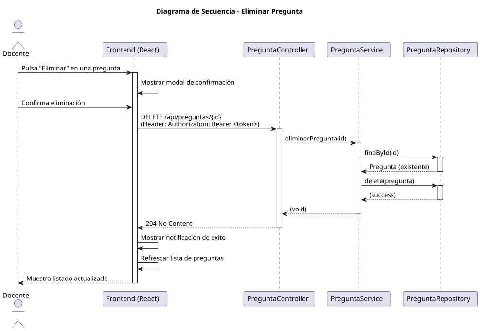

# Jorgestor > eliminarPregunta > Diseño

> |[🏠️](/documents/diseño/README.md)|[📊](../../../archivosEsenciales/casos-de-uso/diagramasDeContexto/diagramaDeContextoDocente/diagramaContexto.svg)|[Análisis](/documents/analisis/eliminarPregunta/README.md)|**Diseño**|Desarrollo|Pruebas|
> |-|-|-|-|-|-|

## Información del artefacto

- **Proyecto**: Jorgestor - Sistema de Gestión de Exámenes
- **Fase RUP**: Elaboración
- **Disciplina**: Diseño
- **Versión**: 1.0
- **Fecha**: 2026-06-03
- **Autor**: Gemini CLI

## Propósito

Detallar la implementación técnica de la eliminación de una pregunta por parte del Docente. Este proceso incluye una fase de confirmación previa en la interfaz de usuario para evitar borrados accidentales.

## Diagrama de secuencia de diseño

||
|-|
|[Código PlantUML](../../../modelosUML/diseño/eliminarPregunta/secuencia.puml)|

## Participantes

- **Frontend (React)**: Componente `PreguntaList.tsx` que gestiona la interacción y la petición de borrado.
- **PreguntaController**: Endpoint `DELETE /api/preguntas/{id}` protegido por `@PreAuthorize("hasRole('DOCENTE')")`.
- **PreguntaService**: Lógica para verificar la existencia de la pregunta y ejecutar la eliminación.
- **PreguntaRepository**: Interface para interactuar con la persistencia y eliminar el registro.

## Decisiones de diseño

- **Confirmación en UI**: Antes de realizar la petición al servidor, el frontend mostrará un cuadro de diálogo de confirmación.
- **Seguridad**: Solo usuarios con el rol `ROLE_DOCENTE` tienen permiso para eliminar preguntas.
- **Respuesta HTTP**: Se utilizará el código de estado `204 No Content` tras una eliminación exitosa.
- **Integridad Referencial**: El servicio debe verificar si la pregunta está asociada a algún examen antes de permitir su eliminación para evitar violaciones de integridad en el historial de evaluaciones.
- **Refresco Visual**: Tras la eliminación, el listado de preguntas se actualizará automáticamente eliminando la fila correspondiente.
