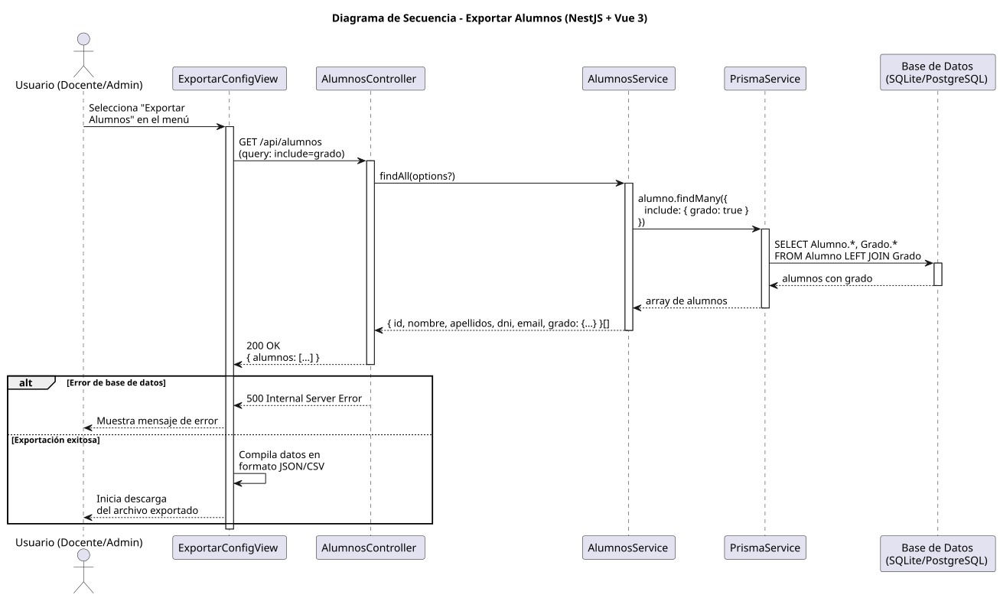

# 25-26-idsw2-sdVC > exportarAlumnos > Diseño

## Información del artefacto

| Campo | Valor |
|-------|-------|
| **Proyecto** | Sistema de Gestión de Exámenes Universitarios |
| **Fase RUP** | Elaboración |
| **Disciplina** | Diseño |
| **Versión** | 1.0 (NestJS + Vue 3) |
| **Fecha** | 2026-06-09 |
| **Autor** | Marcos Gutierrez |

## Propósito

Detallar la interacción entre los componentes del sistema para exportar todos los alumnos del sistema en formato JSON, incluyendo sus datos completos y el grado asociado, como sub-operación de `exportarConfiguracionGlobal()`.

## Diagrama de secuencia de diseño

||
|-|
|Código fuente: [secuencia.puml](../../../modelosUML/diseño/exportarAlumnos/secuencia.puml)|

## Participantes

| Componente | Responsabilidad |
|---|---|
| **ExportarConfigView** | Vista del caso de uso padre que permite al usuario seleccionar la exportación de alumnos y descargar el archivo resultante. |
| **AlumnosController** | Endpoint REST `GET /api/alumnos` que devuelve todos los alumnos con su relación a grado. |
| **AlumnosService** | Método `findAll()` que consulta todos los registros de Alumno incluyendo la relación con Grado mediante `include: { grado: true }`. |
| **PrismaService** | Capa ORM que ejecuta la consulta con JOIN entre Alumno y Grado. |
| **Base de Datos (SQLite/PostgreSQL)** | Almacena los alumnos y sus relaciones con grados. |

## Decisiones de diseño

| Decisión | Justificación |
|---|---|
| **Caso abstracto sin vista propia** | `exportarAlumnos()` es sub-operación de `exportarConfiguracionGlobal()`, no tiene interacción directa con el actor. La vista pertenece al caso padre. |
| **Reutilización de endpoint existente** | El endpoint `GET /alumnos` con `include=grado` ya existe y devuelve exactamente los datos necesarios para la exportación. No requiere endpoint nuevo. |
| **include con JOIN automático** | Prisma resuelve automáticamente la relación `grado` con un JOIN, devolviendo los datos del grado嵌入ados en cada alumno. |
| **Consulta sin paginación** | La exportación masiva requiere todos los registros. Si el volumen fuera alto, se implementaría paginación en background. |
| **Compilación en frontend** | El frontend compila los datos recibidos en el formato de archivo solicitado (JSON/CSV) antes de la descarga. |
| **Manejo de error centralizado** | Cualquier error de BD se propagará como excepción HTTP (500) manejada por el error handler global. |
| **Seguridad por capas** | `JwtAuthGuard` + `RolesGuard` protegen el endpoint. Solo usuarios con rol `DOCENTE` o `ADMIN` pueden exportar. |
| **Formato JSON como estándar** | JSON permite representar estructuras jerárquicas (alumno + grado) de forma natural y es universalmente parseable. |
